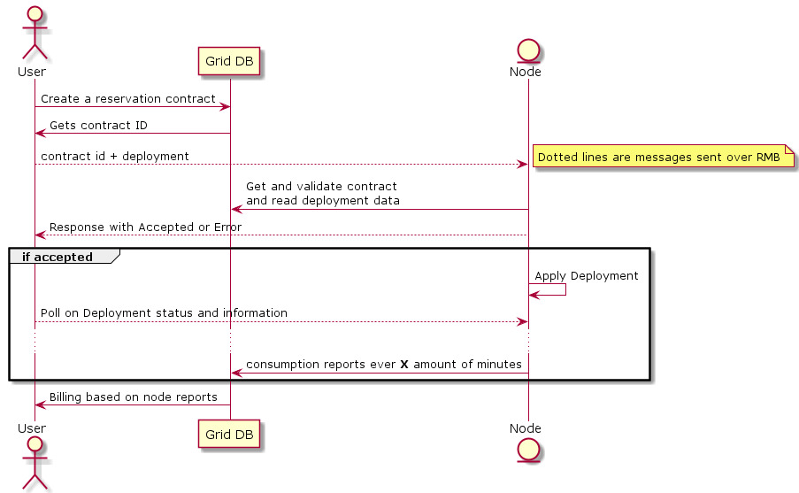

## Overview

> TODO: not good yet

The architecture can be described as follows:

- Components talk to each other on the 'Planetary Network' using Yggdrasil.
- Nodes and users have to create a “twin” object on TF-Chain which is associated with an Yggdrasil IP address. Then, to communicate with any other twin, the IP can be looked up using the twin ID, over the 'Reliable Message Bus' (RMB).
- When starting for the first time, the node needs to self-register on the TF-Chain, which is a decentralized database, built on top of Substrate. The registration need to have information about:
  - Which farm it belongs to;
  - What capacity it has;
  - Twin ID for that node (which is associated with its Yggdrasil IP);
  - Public Configuration.
- Once an identity has been created, secure and trusted communication can be established between the different parties.
- Before deploying a workload, a user needs to go through the following steps :
  - Create a **contract** on Substrate, which describes the conditions under which capacity is reserved (with whom, for how long, ...)
    - The **contract process** is described in more details [here](grid3_contract_flow)
    - The contract also contains the required number of public IPs to be reserved from the farm (in case you have public IPs in your deployment definition)
  - Substrate needs to validate the contract, user, funds and lock up the required public IPs from the farm object.
  - Once a contract is created, the contract **id + deployment** is sent to the node.
  - The node then can read the contract data, validate and apply them. Deployment status can then be queried over RMB directly from the node.
  - Node will also send consumption reports to the contract, the contract then can start billing the user.

