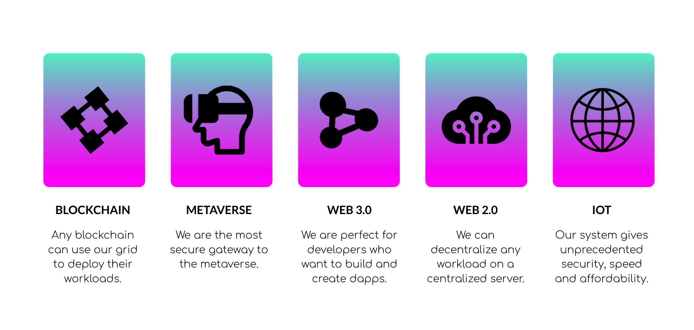
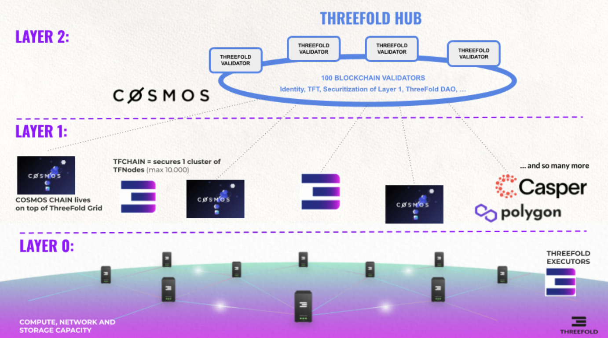
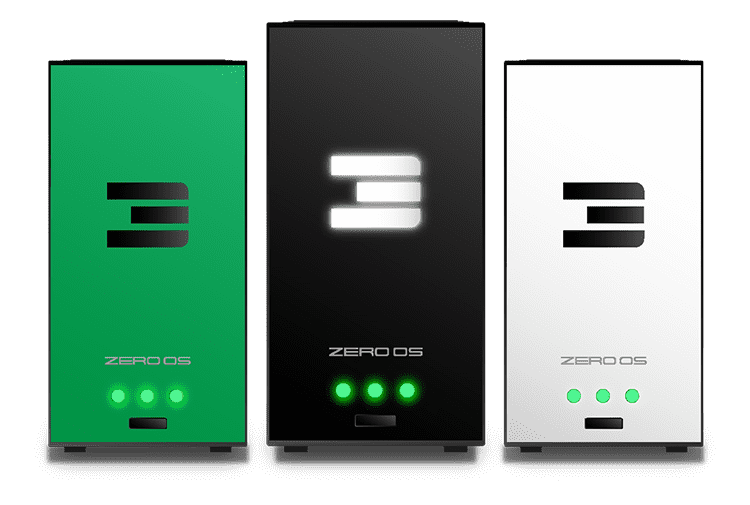

> Welcome to the Threefold FAQ!
>     
> This project is a collective effort aiming at a conscious internet,
> for the people, by the people. 
>    
> Threefold grows as the TF community creates and shares knowledge.
>    
> A big thank you to all the farmers, developers and users who contributed, directly or indirectly, to this FAQ. 


*Hint: Use the search function (Ctrl+F) to locate specific keywords*

*If you can't find the answer to your question*, <a href="#manual__faq?id=ask-a-question-to-the-threefold-community">ask the Threefold Community</a>!


<h2>Main Sections</h2>

- [General FAQ](#general-faq)
- [Users FAQ](#users-faq)
- [Developers FAQ](#developers-faq)
- [Validators FAQ](#validators-faq)

# GENERAL FAQ


<h3>General FAQ Sections<h3>

- [Basic Facts](#basic-facts)
- [Threefold Communication](#threefold-communication)
- [The Technology of Threefold](#the-technology-of-threefold)
- [Buying and Transacting TFT](#buying-and-transacting-tft)
- [TF Connect App TF Dashboard GraphQL Grid Proxy and Polkadot Substrate](#tf-connect-app-tf-dashboard-graphql-grid-proxy-and-polkadot-substrate)
- [Threefold Commercial Grid Services](#threefold-commercial-grid-services)


## Basic Facts

- <details><summary>What is the the Threefold blockchain?</summary>&nbsp;

    ```diff
    + ThreeFold blockchain is the layer 0 infrastructure for an open source peer-to-peer (P2P) Internet owned by humanity.
    ```
</details>

- <details><summary>What is the architecture of the Threefold Grid in simple terms?</summary>&nbsp;

    Essentially, the Threefold Grid is composed of the people using it, the 3node servers offering compute, storage and network resources, and the TF Chain, which is the blockchain of Threefold.

    Middleware is also used, such as GraphQL and GrixProxy, to get and organize data from the Threefold Chain.
    Middleware helps to make data available and to manage load.

    3nodes store workloads data and can report on their state to the TF Grid and to middleware.

</details>

- <details><summary>What is the Threefold Token? What are the uses of the Threefold token (TFT)?</summary>&nbsp;

    ThreeFold Token (TFT) is a decentralized digital currency used to buy autonomous and decentralized Internet services (compute, storage, applications) on the ThreeFold Network – generated only when active capacity is added to the ThreeFold Grid.
    It has a specific commercial utility, since ThreeFold Tokens were conceived as the designated currency for buying and selling capacity on the ThreeFold Grid.
</details>

- <details><summary>How are Threefold Token (TFT) produced?</summary>&nbsp;

    ThreeFold Tokens are exclusively produced through a process called farming, which means that TFT are generated only when new Internet capacity is added to the ThreeFold Grid. There is no wasteful mining.

</details>

- <details><summary>How are the TFT managed?</summary>&nbsp;

    TFT are managed by the ThreeFold Blockchain (“TF Chain”).

</details>

- <details><summary>What is the difference between Internet capacity and connectivity? Does ThreeFold replace my Internet service provider (ISP)?</summary>&nbsp;

    In simple terms, the Internet is composed of both capacity and connectivity. Capacity is where the data and resources are being handled, for example in servers. Connectivity is the infrastructure that transfer data and resources between servers. The latter is linked to the typical Internet service provider (ISP).

    ThreeFold’s technology enables distributed capacity generation, but Threefold doesn’t deal in connectivity.
    3nodes offer Internet capacity, but farmers still rely on connectivity provider like the usual Internet service provider (ISP).

</details>

- <details><summary>I've read that Threefold is Carbon Negative, what does this imply?</summary>&nbsp;

    In short, to accomplish a Carbon Negative footprint, Threefold has a general strategy and many tactics that are all aimed at building and contributing to a regenerative and resilient environment. In long, read this [post](https://forum.threefold.io/t/supporting-initiatives-to-regenerate-the-planet/).

</details>

- <details><summary>Who are the people working for Threefold?</summary>&nbsp;

    People from all over the world contribute to the growth of Threefold. Meet them [here](https://threefold.io/people/).

</details>

- <details><summary>Who are the co-founders of Threefold?</summary>&nbsp;

    The [co-founders](https://threefold.io/memberships/cofounders/) of Threefold are:

    - [Adnan Fatayerji](https://www.threefold.io/people/adnan-fatayerji/)
    - [Christopher Hutton](https://www.threefold.io/people/christopher-hutton/)
    - [Kristof de Spiegeleer](https://www.threefold.io/people/kristof-de-spiegeleer/)
    - [Nickolay Babenko](https://www.threefold.io/people/nickolay-babenko/)
    - [Owen Kemp](https://www.threefold.io/people/owen-kemp/)
    - [Rob Van Mieghem](https://www.threefold.io/people/rob-van-mieghem/)
    - [Weynand Kuijpers](https://www.threefold.io/people/weynand-kuijpers/)

</details>

- <details><summary>In a nutshell, what can be said of the Threefold team?</summary>&nbsp;

    The Threefold team is spread across the world and its members built some of the world’s best Internet storage and cloud automation technologies since the ‘90s. 

</details>

- <details><summary>What is the mission of Threefold?</summary>&nbsp;

    The mission of Threefold is to create a peer-to-peer Internet that can host all of humanity’s digital workloads via smart contract, removing all forms of centralization from global IT systems.

</details>

- <details><summary>Who are the partners of Threefold?</summary>&nbsp;

    Threefold has great [partners](https://threefold.io/partners/) and we are proud of the amazing projects we have done throughout the years. Building the New Internet is a collective project and the Threefold team is always ready to create and collaborate with new partners aligned with our Planet first ethos.

    To learn more about our certified farming partners, click [here](https://marketplace.3node.global/index.php?dispatch=companies.catalog).

</details>


- <details><summary>What are the priorities of Threefold (the Three P of Threefold)? Threefold is a Planet first project, what does it mean?</summary>&nbsp;

    Threefold is working for the Planet, the People and Profit, in this very order of importance. Planet comes first as it is our home to us all. A humane enterprise always has people before profit, and serious entrepreneurs know profit cannot be left out of the equation of a thriving project.

</details>


- <details><summary>I want to farm TFT with a 3node. What are my choices?</summary>&nbsp;

    There are two possibilities. Either [buy a certified 3node](https://marketplace.3node.global/) (plug n play) or build yourself a <a href="#manual__faq?id=what-are-the-general-requirements-for-a-diy-3node">DIY 3node</a>.

</details>

- <details><summary>I want to buy a certified 3node server from a reliable source. Who are Threefold's partners offering certified 3nodes?</summary>&nbsp;

    You can find the continually growing list of Threefold's partners provoding high-quality 3nodes [here](https://marketplace.3node.global/index.php?dispatch=companies.catalog).

</details>

- <details><summary>I want to help build the new Internet. How can I become a Threefold certified 3node partner?</summary>&nbsp;

    Apply [here](https://marketplace.3node.global/index.php?dispatch=companies.apply_for_vendor) to become a Threefold certified 3node partner.

</details>

- <details><summary>How is Threefold registered as an entity?</summary>&nbsp;

    Threefold has different registrations and each serves a different purpose.

    There is Threefold VZW, in Belgium. Note that *VZW* is Belgium's denotation for non-profit association. Read more [here](https://library.threefold.me/info/legal/#/orgstructure/threefold__threefold_vzw).

    There is also Threefold DMCC, in Dubai. Read more [here](https://library.threefold.me/info/legal/#/threefold__threefold_dubai).

    There is also ThreeFold Tech NV, a software company which owns the IP of the code delivered. Read more [here](https://threefold.tech/) and [here](https://www.crunchbase.com/organization/threefold-tech).


</details>

- <details><summary>Where is ThreeFold Tech's headquarters?</summary>&nbsp;

    ThreeFold Tech is located in Lochristi, Oost-Vlaanderen, Belgium.

</details>

- <details><summary>Can I have more information on Threefold Tech NV and Threefold S.A.?</summary>&nbsp;

    Of course. Here are the basic information:

    * TF Tech NV (ThreeFold Tech)
      * Registered at the Belgian Chamber of Commerce under number 0712845674.
      * TF Tech NV is a limited liability organisation under the laws of Belgium. TF TECH NV. Antwerpse Steenweg 19 9000 - Lochristi, Belgium info@threefold.tech BE 0712.845.674
    (RPR Gent) Tel: 0032-93242057

    * ThreeFold S.A. (TF LUX)
      * A public limited liability company under the Company Number B265333, governed by the laws of the Grand Duchy of Luxembourg.
      * ThreeFold S.A., 6, Rue Dicks, 1417, Luxembourg.

</details>

***

## Threefold Communication

- <details><summary>Is there a Threefold app for mobile?</summary>&nbsp;

    Yes! Threefold Connect App (TF Connect App) is available for [Android](https://play.google.com/store/apps/details?id=org.jimber.threebotlogin) and [iOS](https://apps.apple.com/us/app/threefold-connect/id1459845885).

    You can use this app to create a Threefold ID, a Threefold Wallet and also a Threefold Farm to link all your 3nodes.
    The Threefold Connect Wallet, with its Stellar payout address, can be used for transactions as well as to receive farming rewards.
    The News section gives you the latest information on the fast Threefold development and growth.

</details>

- <details><summary>I want to reach the Threefold community. What are Threefold social links?</summary>&nbsp;

    You can find links to the Threefold community [here](https://threefold.io/community). Here's a quick list:

    - [Threefold Twitter](https://twitter.com/threefold_io)
    - [Threefold Forum](https://forum.threefold.io/)
    - [Threefold Github](https://github.com/threefoldtech)
    - [Threefold Telegram News](https://t.me/threefoldnews)
    - [Threefold Telegram General](https://t.me/threefold)
    - [Threefold Telegram Grid Tester Community](https://t.me/threefoldtesting)
    - [Threefold Telegram Farmer](https://t.me/threefoldfarmers)
    - [Threefold Reddit](https://www.reddit.com/r/threefold/)
    - [Threefold Youtube](https://www.youtube.com/threefoldfoundation)
    - [Threefold LinkedIn](https://www.linkedin.com/authwall?trk=qf&originalReferer=https://threefold.me/&sessionRedirect=https%3A%2F%2Fwww.linkedin.com%2Fcompany%2Fthreefold-foundation%2F)

</details>

- <details><summary>Is there a Discord group for Threefold?</summary>&nbsp;

    Yes! It’s [right here](https://discord.com/invite/PaQtT7A72E). Threefold is decentralized. This is a community initiative. Come and talk. Let's New Internet!

</details>

- <details><summary>How can I reach Threefold Support?</summary>&nbsp;

    Go on the [Threefold Connect App](#is-there-a-threefold-app-for-mobile) and select Support or go on the [Threefold website](https://threefold.io), accept the cookies and click on the bottom right icon for chat.

</details>

- <details><summary>Is there a Threefold podcast?</summary>&nbsp;

    Yes, there is a Threefold podcast! Hosted by Kyle Ellicot, it is available to listen on [Spotify](https://open.spotify.com/show/5RPjpvCYECrkq4sAM6hOfq) and on [anchor.fm](https://anchor.fm/threefoldpodcast).

</details>

- <details><summary>Who can I write to for a proposal? Where can I send a proposal email for a new partnership opportunity with Threefold?</summary>&nbsp;

    You can mail your proposal to info@threefold.io or write about your proposal on the [Threefold Forum](http://forum.threefold.io/).

</details>

- <details><summary>How can I track and follow the progress and development of Threefold?</summary>&nbsp;

    There are two main places where you can track the progress of Threefold. Threefold is open source and its developments can be easily tracked on Github.

    * You can read about the ongoing Threefold Tech projects [here](https://github.com/orgs/threefoldtech/projects).
    * You can read about the ongoing Threefold Foundation projects [here](https://github.com/orgs/threefoldfoundation/projects?query=is%3Aopen).

</details>

- <details><summary>Is there a way to search the FAQ more easily? What is the link for the Threefold FAQ Bot?</summary>&nbsp;

    There is Threefold FAQ Bot available on Telegram. You can ask the bot any questions on Threefold, and it will find the most related Q&A in the Threefold FAQ.

    The link to the Threefold FAQ Bot is the following: https://t.me/TF_FAQ_Bot.

    </details>

***

## The Technology of Threefold

- <details><summary>What is a 3node?</summary>&nbsp;

    It is essentially a single server that makes up a larger network of servers which together form the Threefold Grid. Essentially any modern computer can be turned into a 3node (DIY Farming) and you can [buy plug and play 3nodes](https://marketplace.3node.global/index.php) as state of the art modern computer.

</details>

- <details><summary>What is the difference between a 3node and a Threefold farm?</summary>&nbsp;

    A 3node is a single server connected to the Grid. Each 3node is linked to a farm. A farm can be composed of multiple 3nodes. 

</details>

- <details><summary>I've read that Threefold built an Operating System (OS) from scratch, is it true?</summary>&nbsp;

    Indeed, to have a quantum safe technology and nodes capabling on running the widest range of softwares, the team built an operating system from the ground up, the almighty Zero-OS. Read the next question for more info on Zero-OS.

</details>

- <details><summary>What is Zero-OS from Threefold?</summary>&nbsp;

    Zero-OS is a stateless and lightweight operating system designed to host anything that runs on Linux, in a decentralized way. Once installed, Zero-OS locks the hardware and dedicates its capacity to the People’s Internet via the ThreeFold Blockchain.

</details>

- <details><summary>Threefold uses Quantum Safe Storage technology, what does it mean?</summary>&nbsp;

    Quantum computers are theoretically capable of doing huge calculations in a short period of time. By this fact alone, it is a great potential threat to future online safety. Threefold solves this future problem before it even becomes a reality. Indeed, Zero-os can compress, encrypt, and disperse data across the Grid. Learn more [here](https://www2.threefold.io/developer/qsfs/).

</details>

- <details><summary>Quantum Safe File System (QSFS) allows for part of the storage to go down and it can self repair, however it’s still attached to a single VM and a single point of failure. Can a QSFS instance be reattached to another VM to recover it?</summary>&nbsp;

    QSFS is built from storage devices which are distributed and decentralized.

    The storage engine is a software running on a VM that can run everywhere.
    If the storage engine needs to run on a different VM the config needs to pushed to the new VM.
    In short, yes Quantum safe file system (QSFS) can be recovered on a different VM. It is not automated yet on Zero-OS. A video tutorial will be shared soon.

</details>


- <details><summary>Where does the Threefold Explorer take its data from?</summary>&nbsp;

    The Threefold Explorer takes its data from this website: https://gridproxy.grid.tf/.

</details>

- <details><summary>Is there a way to see the Threefold Grid's metrics?</summary>&nbsp;

    You can see the Threefold Grid Devnet's metrics on the page [metrics.grid.tf](https://metrics.grid.tf/). The metric tool is using Grafana, an open source visualization web application.

    To see the statistics of the Threefold Grid in general, visit the [Threefold Dashboard](https://dashboard.grid.tf/explorer/statistics) and select Statistics in the left menu Explorer.

</details>

- <details><summary>How can I connect to the Threefold Planetary Network?</summary>&nbsp;

    You can connect with your phone by using the Threefold Connect App.
    Simply select the Planetary Network option in the menu.

    To connect on a computer, you can download the pre-release vesion of the [Threefold Planetary Network connector](https://github.com/threefoldtech/planetary_network).
 
</details>

- <details><summary>Where can I download the Threefold Planetary Network connector?</summary>&nbsp;

    It is available in the Threefold [Planetary Network](https://github.com/threefoldtech/planetary_network) repository on Github.
    You can download pre-release versions [here](https://github.com/threefoldtech/planetary_network/releases) for MAC, Linux and Windows.

</details>

- <details><summary>What is Proof-of-Capacity used by Threefold?</summary>&nbsp;

    Proof-of-Capacity is an algorithm that verifies the Internet capacity provided by the 3nodes. More information can be found [here](https://library.threefold.me/info/threefold#/tfgrid/farming/threefold__proof_of_capacity).

</details>

- <details><summary>What is Proof-of-Utilization?</summary>&nbsp;

    [Proof-of-Utilization](https://library.threefold.me/info/manual/#/tfgrid/farming/threefold__proof_of_utilization) is the underlying mechanisms that verifies the utilization of Internet capacity on the ThreeFold Grid.

    Every hour, the utilization is recorded in [TFChain](https://library.threefold.me/info/manual/#/tfgrid/farming/threefold__tfchain) and the user is charged for the Internet capacity used on the ThreeFold Grid. Discount calculated in line with the amount of [TFT](https://library.threefold.me/info/manual/#/tfgrid/farming/threefold__threefold_token) users have in their accounts on TFChain. Learn more about the discount [here](https://library.threefold.me/info/manual/#/tfgrid/farming/threefold__staking_discount_levels).

</details>

- <details><summary>How does Proof-of-Utilization work? How is the Threefold Token (TFT) distributed when there is utilization on the Threefold Grid?</summary>&nbsp;

    Here are the general steps of the Proof-of-Utilization process:

    1. A user reserves Internet capacity on a given set of [3Nodes](https://library.threefold.me/info/manual/#/tfgrid/farming/threefold__3node). 
    2. [Zero-OS](https://library.threefold.me/info/manual/#/tfgrid/farming/threefold__zos) records the reserved and used CU, SU, NU and IPAddresses in correlation with [TFChain](https://library.threefold.me/info/manual/#/tfgrid/farming/threefold__tfchain) records. 
    3. The TFChain [DAO](https://library.threefold.me/info/manual/#/tfgrid/farming/threefold__dao) will charge the costs to the user in line with [discount mechanism](https://library.threefold.me/info/manual/#/tfgrid/farming/threefold__staking_discount_levels). 
    4. [TFT](https://library.threefold.me/info/manual/#/tfgrid/farming/threefold__threefold_token) from the user account are burned/distributed in line to table below.

    When people spend Threefold Tokens on the Threefold Grid for any kind of deployment, the TFT is distributed as per the Proof-of-Utilization distribution flow. 

    The Proof-of-Utilization distribution flow is the following:

    * 50% goes to solution providers and sales channels*
    * 35% goes to TFT burning
    * 10% goes to the Threefold Foundation
    * 5% goes to the Validator Staking Pool

    To see the Proof-of-Utilization distribution flow chart, check this [link](https://library.threefold.me/info/threefold#/tokens/threefold__token_overview).

    *Note: For billing purposes, ThreeFold DAO will check if the workload comes from a known sales channel and/or solution provider. If yes, then the billing smart contract code will know how to distribute the TFTs. If the sales channel and/or solution provider is not known, then the 50% will go to a DAO owned Community Grant Wallet.

</details>

***

## Buying and Transacting TFT

- <details><summary>How can I buy TFT?</summary>&nbsp;

    There are many ways to do this. You can buy on [PancakeSwap](https://pancakeswap.finance/), on [BTC-Alpha](https://btc-alpha.com/en/trade/TFT_BTC?layout=standard&type=spot) or on the [GetTFT website](https://gettft.com/gettft/). For more information, check [this link](https://library.threefold.me/info/threefold#/tokens/threefold__how_to_buy). 

</details>

- <details><summary>What is the maximum supply of Threefold tokens? What is the current supply of Threefold tokens?</summary>&nbsp; 

    The maximum token supply of the Threefold Token (TFT) is 4 billion. You can read more about this [here](https://library.threefold.me/info/threefold#/tokens/threefold__stats_token_overview_farmed).

    As of now, more than 880 000 000 Threefold tokens (TFT) have been farmed. 

</details>

- <details><summary>How is the Threefold Token(TFT) created (minted)? Threefold Token is a pure utility token. What does this mean?</summary>&nbsp;

    Threefold Tokens (TFT) are created (minted) by the ThreeFold Blockchain (TFChain) only when new Internet capacity is added to the ThreeFold Grid by farmers. For this reason, TFT is a pure utility token as minting is solely the result of farming on the Threefold Grid.

</details>

- <details><summary>Where can I find TFT, concretely? On which blockchains is TFT available?</summary>&nbsp;

    - Stellar Chain
      - Most TFT exist on Stellar at the moment and this is the chain where all farming rewards are currently distributed.
    - Threefold Chain
      - the new ThreeFold blockchain that’s used for billing on Grid v3 and will be used to pay Grid v3 farmers at some point in the future.
    - Binance Smart Chain
      - Binance Smart Chain (BSC) - this TFT exists mostly for buying, selling, and providing liquidity on Pancake Swap 2.

</details>

- <details><summary>What are the uses for each different blockchains offering TFT?</summary>&nbsp;

    - Threefold Chain (TF Chain)
      - TF Chain is used to store the full infrastructures of
        - farms
        - nodes
        - contracts
        - billing reports
        - etc.
      - TFT can be used as Internet Capacity on the Threefold Grid
    - Stellar Chain
      - Stellar is used as a payment network
      - TFT is minted on Stellar Chain
    - Binance Smart Chain (BSC)
      - TFT can be traded and moved on Binance Smart Chain

    Note that TFT is fundamentally a utility token. It is Internet capacity farmed by TF Farmers and used by TF Users.

</details>

- <details><summary>What is the interplay between Stellar Chain and TF Chain?</summary>&nbsp;

    Stellar is basically a payment network. But we also need a decentralized way to store the full infrastructure of farms, nodes, contracts, billing reports etc. This is available now on TFChain, as you can see [here](https://graphql.grid.tf/graphql). 

    Stellar remains very good when it's purely about fast payment, while TF Chain is used as the decentralized blockchain of the New Internet.

    It's why both remain active, with a bridge in-between to enable transfer of the same tokens on two blockchain infrastructures.

    Note that TFT is also available on BSC.

</details>

- <details><summary>Is there a bridge between Binance Smart Chain (BSC) and Stellar to transfer TFT?</summary>&nbsp;

    Yes! It's over [here](https://bridge.bsc.threefold.io/).

</details>

- <details><summary>What are the different Threefold bridges, TFChain-Stellar Bridge and BSC-Stellar Bridge? How can I go from TF Chain to Stellar chain to Binance Smart Chain?</summary>&nbsp;

    In short, there is the [BSC-Stellar Bridge](https://bridge.bsc.threefold.io/) and the [TF Chain-Stellar](https://dashboard.grid.tf/) Bridge.

    The BSC-Stellar Bridge is used to go between the Stellar Chain and Binance Smart Chain (BSC).
    The TFChain-Stellar Bridge is used to go between Stellar Chain and TF Chain.

    To go from BSC to TF Chain, or from TF Chain to BSC, you need to use the two bridges.

    BSC can be used to sell/buy TFT while TF Chain can be used to deploy Dapps on https://play.grid.tf

</details>

- <details><summary>How can I bridge TFT from Stellar chain to TF Chain and vice versa?</summary>&nbsp;

    Go on the [Threefold Dashboard](https://dashboard.grid.tf/), sign-in with your Polkadot extension account and then go in the section Twin if you aren't there already. Click on *Bridge TFT from Stellar* to transfer TFT from Stellar to TF Chain.
    Click on *Bridge TFT to Stellar* to transfer TFT from TF Chain to Stellar.

    Note: If you are on Threefold Connect App, you can export your account to the Polkadot extension. Look at the section *Move Farm from the TF app to the TF Dashboard (polkadot.js)* in the Threefold Farming Guide Part 2.

</details>

- <details><summary>How can I bridge TFT from Binance Smart Chain (BSC) to Stellar (and vice versa)?</summary>&nbsp;

    To use the [BSC-Stellar Bridge](https://bridge.bsc.threefold.io/), read the following steps. If this is your first time with MetaMask and BSC, read the section <a href="#manual__faq?id=how-to-set-up-tft-on-metamask">How to Set Up TFT on Metamask</a> below.

    Note: Always start with a small amount the first time you try the Bridge.

</details>

- <details><summary>How to use the BSC-Stellar Bridge</summary>&nbsp;

    To use the BSC-Stellar Bridge, follow the following steps. If this is your first time with MetaMask and BSC, read the section Setting up TFT on Metamask.

    Note: Always start with a small amount the first time you try the Bridge.

    **How to Bridge TFT from Stellar to BSC**
    *
    Pre-requisites:

    * Metamask account
    * TF Connect App+Wallet
    * TFT on Stellar Blockchain

    Steps

    1. Go to the BSC-Stellar [Bridge website](https://bridge.bsc.threefold.io/).
    2. Connect your MetaMask Wallet.
    3. Sign in with MetaMask.
    4. Choose the option  *Deposit from Stellar*.
    5. Agree to the  *Threefold Terms*.
    6. Read and tick the box of the  *Warning Message*.
    7. On your phone, open up your Threefold Connect App and go to the wallet section.
    8. Select the option  *Send*.
    9. Select the  *Stellar*  chain.
    10. Click on the button  *Scan QR Code* . The QR Code option automatically fill up your  *MESSAGE*.
    11. Scan the QR code that appears on the Bridge window (or write the information manually).
    12. Make sure the  *MESSAGE*  is correctly entered.
    13. Press  *Send Tokens*.
    14. Press  *Confirm*.

    In this method, you use the Bridge directly. Thus, it is normal if you do not see your standard MetaMask address. MetaMask is on ERC20 and TFT is on Stellar. You are sending TFT to the Bridge's address, and the Bridge sends money to your wallet afterward.


    **How to Bridge TFT from BSC to Stellar**

    Pre-requisites:

    * Metamask account
    * TF Connect App+Wallet
    * BNB for gas fees
    * TFT

    Steps

    1. Go to the BSC-Stellar [Bridge website](https://bridge.bsc.threefold.io/).
    2. Connect your MetaMask Wallet.
    3. Sign in with MetaMask.
    4. Choose the option  *Deposit from BSC*.
    5. Agree to the  *Threefold Terms*.
    6. Read and tick the box of the  *Warning Message*.
    7. On your phone, open up your Threefold Connect App and go to the wallet section.
    8. Copy your Stellar address.
    9. Paste your Stellar address in the proper field on The BSC-Stellar Bridge.
    10. Enter the amount of TFT you want to bridge.
    11. Click on  *Withdraw*.
    12. Follow the instructions on your Metamask Wallet.

    General Tips

    * It's a good idea to start with a small amount the first time.
    * The process is usually quick, but it can take up to 48h. In doubt, contact [TF Support](https://threefold.io/support/).
    * Going from Stellar to BSC costs 50 TFT.
    * Going from BSC to Stellar costs 1 TFT.
    * There is also fixed fee of 0.01 TFT when using the Stellar Blockchain.
    * Gas fees on BSC is usually around 5-20 gwei.
    * You can try the bridge later if gas fees are high at the moment of your transaction.

</details>

- <details><summary>How to Set Up TFT on Metamask</summary>&nbsp;

    To set up Threefold token (TFT) on Metamask, you can follow those simple steps:

    * Download Metamask [here](https://metamask.io/download.html). Then, install the Metamask extension in your local browser.
    * Create a Metamask account
    * Switch the network to  `Binance chain` . You will have to create a new network with following information):
      * Mainnet
      * Network Name: Smart Chain
      * New RPC URL: https://bsc-dataseed.binance.org/
      * ChainID: 56
      * Symbol: BNB
      * Block Explorer URL: [https://bscscan.com](https://bscscan.com/)
    * Add TFT token in Metamask
      * go to custom token
      * write the following contract address:  `0x8f0FB159380176D324542b3a7933F0C2Fd0c2bbf`.

</details>

- <details><summary>How to set up a Stellar address for TFT transactions?</summary>&nbsp;

    In general, to set up a Stellar address to transact TFT on Stellar chain, you can use any Stellar wallet that has a TFT trustline enabled. Note that on Stellar chain, fees are paid in XLM. 

    The easiest way is to simply create an account on the Threefold Connect App (for [Android](https://play.google.com/store/apps/details?id=org.jimber.threebotlogin) and [iOS](https://apps.apple.com/us/app/threefold-connect/id1459845885)) and to then use the TFT wallet of the app, which has by default a TFT trustline on Stellar chain and also comes with 1 XLM sponsored by Threefold for transaction fees.

</details>

- <details><summary>How long does it take when you use the BSC-Stellar Bridge?</summary>&nbsp;

    The bridge will process deposits/withdrawals within 48 hours.

</details>

- <details><summary>What are the cost when bridging from Stellar to MetaMask and from MetaMask to Stellar?</summary>&nbsp;

    It will cost 50 TFT for the former, and 1 TFT for the latter. There is a fixed fee of 0.01 TFT when using the Stellar blockchain. Those fees are taken from the total of what you are bridging. For example, if you Bridge 80 TFT, from Stellar to MetaMask, you will receive 30 TFT.

</details>

- <details><summary>What is the network information to access BSC for the Threefold token? What is the token address for adding the token in the MetaMask app?</summary>&nbsp;

    Here it is:
    * Mainnet
    * Network Name: Smart Chain
    * New RPC URL: https://bsc-dataseed.binance.org/
    * ChainID: 56
    * Symbol: BNB
    * Block Explorer URL: [https://bscscan.com](https://bscscan.com/)

    BSC TFT Token Address: 0x8f0FB159380176D324542b3a7933F0C2Fd0c2bbf

    For more information, read [this](https://library.threefold.me/info/threefold#/tokens/threefold__tft_bsc_metamask).

</details>

- <details><summary>How can I trade TFT on Pancake Swap? How can I add TFT on Pancake Swap?</summary>&nbsp;

    When searching for a Token on Pancake Swap (Select a Token), paste the TFT Token Address : 0x8f0FB159380176D324542b3a7933F0C2Fd0c2bbf, then select TFT. You can now trade TFT on Binance Smart Chain.

</details>

- <details><summary>How can I swap Threefold tokens (TFT) on Stellar Blockchain?</summary>&nbsp;

    It is possible to swap TFT on Stellar Chain. Here's how to do it with [StellarX](https://stellarx.com).

    First, make sure your wallet has a TFT trustline. Second, go on [StellarX Swap section](https://stellarx.com/swap). Third, choose TFT and the other token of the swapping pair then swap. If you do not see TFT, make sure you have a TFT trustline linked to your wallet.

</details>

- <details><summary>On my website, users can donate TFT on the Stellar Chain. Is there a way for users on my website to easily track the total sum of TFT donated?</summary>&nbsp;

    There is a simple way to do this. The [Stellar Explorer](https://stellar.expert/explorer/public) has an embeddable widget that you can insert on any website, including WordPress. 

    Simply go to the account you’re interested in showing the balance of, look for “Balance History”, select TFT, and finally click the small icon next to the heading to reveal the embed code. In your WordPress page editor, in HTML mode, paste the embed code.

</details>

***

## TF Connect App TF Dashboard GraphQL Grid Proxy and Polkadot Substrate

- <details><summary>What is the Threefold Connect App download link?</summary>&nbsp;

    Threefold Connect App (TF Connect App) is available for download on [Android](https://play.google.com/store/apps/details?id=org.jimber.threebotlogin) and on [iOS](https://apps.apple.com/us/app/threefold-connect/id1459845885).

</details>

- <details><summary>What is the Threefold Dashboard link?</summary>&nbsp;

    To go on the Threefold Dashboard, use this link [https://dashboard.grid.tf/](https://dashboard.grid.tf/).

</details>

- <details><summary>To access the TF Dashboard, I need to use the Polkadot Extension. What is the link for the Polkadot Extension (polkadot.js)? Which browsers support the Polkadot Extension?</summary>&nbsp;

    The link to the Polkadot Extension is the following: [https://polkadot.js.org/extension/](https://polkadot.js.org/extension/).

    Polkadot.js is available for the following browsers: Chrome, Brave and Firefox. To install it on Brave, use the Chrome link.

</details>

- <details><summary>Is there a way to create or import another wallet in TF Connect App?</summary>&nbsp;

    The TF Connect App supports Stellar and TF Chain wallets. The app by default can create one wallet. To add any number of additional wallets, you must create a wallet on Stellar or TF Chain and then import it with the import function.

</details>

- <details><summary>I created a farm on the TF Chain. On the TF Connect App Farmer Migration section, my farm is under Other v3 farms, is this normal?</summary>&nbsp;

    Yes this is normal. Farms created on TF Chain instead of the TF Connect App will appear in *Other v3 farms*.

</details>

- <details><summary>I am trying to access my wallet in the Threefold Connect App. It worked fine before, but now I just get a white screen. What does it mean and what can I do?</summary>&nbsp;

    On the TF Connect App, when you get a white screen, it means that there is a connection issue. It can help to try other networks; maybe try switching between ethernet cable or wifi. Or you can also try it later when the connection might be more stable.

</details>

- <details><summary>When I open the Threefold Connect App, I get the error: Error in initialization in Flagsmith. How can I fix this issue?</summary>&nbsp;

    To fix this Flagsmith error message on the Threefold Connect app, you can try the following methods:

    * Check your internet connection
    * Update your phone current operating system (OS) version
    * Update the date and time on your phone

</details>

- <details><summary>I have some problems connecting to the Polkadot extension. What can I do?</summary>&nbsp;

    You could try to delete the cache in your browser or try to open it with another browser (Firefox/Brave/Chrome). Sometimes, removing the account and re-entering the seed phrase can also help to fix some issues. Use your seed phrase carefully.

    If you have issues on Firefox, [refreshing the browser](https://support.mozilla.org/en-US/kb/refresh-firefox-reset-add-ons-and-settings#w_refresh-firefox) can help.


</details>

- <details><summary>Apart form the Threefold Connect App Wallet, how can I check my TFT balance?</summary>&nbsp;

    You can go on [Stellar.Expert](https://stellar.expert). With your wallet address, you will be able to see your transactions and wallet details.

</details>

- <details><summary>Is it possible to export the transaction history of a wallet to a CSV file?</summary>&nbsp;

    Yes, every blockchain has an explorer function and these explorer functions allow you to see transactions and export them. TFT is on 2 chains at the moment: Stellar and Polkadot.

    For Stellar based TFT’s there is an explorer here: https://stellar.expert/explorer/public. Enter you wallet address in the top left search box, and after pressing enter you should see every transaction related to your account.

    If you are not deploying/doing things on the TF Grid (dev, test or mainnet) you will not have transferred any tokens to the TF Chain, therefore all your tokens/wallets will be on the Stellar Chain.

</details>

- <details><summary>What is the role of the middleware?</summary>&nbsp;

    The middleware takes data from the TF blockchain and present it in a searchable manner.

</details>

- <details><summary>What is Polkadot UI? What can I do with Polkadot UI?</summary>&nbsp;

    It is based on substrate, a framework for building blockchains in the polkadot ecosystem

    You can use polkadot UI to querry information about farms on TF Chain.

    For example, on Polkadot UI, you can see blocks minted on TF Chain. Have a look [here](https://polkadot.js.org/apps/?rpc=wss%3A%2F%2Ftfchain.grid.tf#/explorer).

</details>

- <details><summary>How can I use GraphQl to find information on the Threefold Grid?</summary>&nbsp;

    To find information on the Threefold Grid with GraphQL, go to this [link](https://graphql.grid.tf/graphql). On the left menu, choose the parameters you want to search and write the necessary information, if needed, then click on the Play button in the middle section, at the top. 

    Here's an example of a query, where we want to find all the farms containing "duck" in their name.

    query MyQuery {
      farms(where: {name_contains: "duck"}) {
        name
        farmID
      }
    }

    This code can be written automatically if you simply select the proper parameters in the left menu.
    For the previous example, we had to click on "farms", then "where", and then "name_contains". After clicking on "name_contains", you need to add the words you are looking for, in this example we had "duck". Further down the menu, we simply had to click on "farmID" and "name", and then click the Play button. The results of the query appear on the right screen.

</details>

- <details><summary>How can I use Grid Proxy to find information on the Threefold Grid and 3nodes?</summary>&nbsp;

    To find information on the Threefold Grid with GraphQL, you need to write this URL: https://gridproxy.grid.tf/, followed by your specific query. Here's an example if we wanted to see all the available farm on the TF Grid that has "duck" in its name:

    https://gridproxy.grid.tf/farms?name_contains=duck

    The Grid Proxy is appropriate for high volume application.
    You can find the parameters to be written in the URL when visiting the [GraphQL explorer](https://graphql.grid.tf/graphql).

</details>

- <details><summary>Who is hosting GraphQL and Grid Proxy on the Threefold Grid?</summary>&nbsp;

    GraphQL and Grid Proxy are hosted by Threefold for everyone to use.

    Note that it is also possible to run your own instance of those tools.

</details>

- <details><summary>I do not remember the name (Threefold 3bot ID) associated with my seed phrase on the Threefold Connect app. Can I recover my TF Connect app account with only the seed phrase and not the name (3bot ID) associated with it?</summary>&nbsp;

    If you forgot the name associated with your seed phrase on the TF Connect app, you can always create a new identity (Threefold 3bot ID) and import your wallet using the old seed phrase. 

    Since the Connect App is also used for identity and authentication, you need both the name (3bot ID) and seed phrase to fully recover your account. The wallet is only linked to the seed phrase and not the name (3bot ID).

</details>

***

## Threefold Commercial Grid Services

- <details><summary>What is the concept and the goals of the Threefold Commercial Grid Services project?</summary>&nbsp; 

    The goal of the Threefold Commercial Grid services project is to prove that the current state of the Threefold Grid is enough to start a commercial business. 

    The current TF technology stack is a good set of building blocks to create a service business on. While proving this by doing it we also create content that explains in steps how to use the technical building blocks and put it all together into a full fledged solution.

    The benefits and purposes of this project are manyfold:

    * Showcase that the grid stability and functionality is good enough to do this 
      * Ex: [Zonaris](https://zonaris.com/) trailblazing this independently
    * Allow anyone to build easily
      * Using created documentation and training material
    * Inspire the existing community 
     * Start experimenting with the Grid functionality.
    * Attract non technical users who pay FIAT.
    * Use FIAT to fund and reward Community contribution
      * Documentation updates, weblet improvements, outreach, teaching, etc.

</details>

- <details><summary>Who can participate to the Threefold Commercial Grid Services?</summary>&nbsp;

    This is meant for any internet user, from the basic user to the advanced developer. 
    The services foreseen have non development and IT professionals use cases.

    * Standard use cases
        * Project management
        * Content management systems
        * Social networks
        * Video conferencing
        * More  
    * Developer use cases
        * Full VM's
        * Micro VM's
        * Kubernetes
        * Caprover
        * More

</details>

- <details><summary>What is the method of payment of the Threefold Commercial Grid Services?</summary>&nbsp;

    Onboarding is meant through FIAT. It is comparable to any other online service provider experience.

</details>

- <details><summary>How can I contribute to the Threefold Commercial Grid Services? What is the onboarding process to join the Threefold Commercial Grid Services?</summary>&nbsp;

    * We are actively writing the story with requirements for this online business 
      * Contribute via [GitHub](https://github.com/threefoldtech/home/issues/1378)
    * Give us feedback 
      - [Threefold Forum](https://forum.threefold.io/)
      - [Threefold General TG Channel](https://t.me/threefold)
      - [Threefold Farmer TG Channel](https://t.me/threefoldfarmers)
      - [TF Grid Tester TG Channel](https://t.me/threefoldtesting)

</details>

- <details><summary>What does it mean to be a solution provider on the Threefold Grid?</summary>&nbsp;

    A solution provider offers a solution on the Threefold Grid and receives 50% of the TFT utilization revenues from the workload related to the solution.

    A "solution" is something running on the grid, created by a community member. This can be brought forward to the council, who can vote on it to recognize it as a solution. On contract creation, a recognized solution can be referenced, in which case part of the payment goes toward the address coupled to the solution.

    To become a solution provider, read the next question.

</details>

- <details><summary>How can I become a solution provider on top of the Threefold Grid?</summary>&nbsp;

    Threefold uses the Proof-of-Utilization distribution where 50% of the TFT utilization revenues goes to the solution provider offering a solution. If there is no solution provider associated with the deployment, the 50% revenues goes to a DAO owned Community Grant Wallet.

    There are a few steps to follow to become a solution provider:

    1. Follow the steps detailed in this [documentation](https://github.com/threefoldtech/tfchain/blob/development/substrate-node/pallets/pallet-smart-contract/solution_provider.md)

    2. Then write a [Threefold Forum post](https://forum.threefold.io/c/threefold-grid-utilization/solutions-being-created/76) explaining what the solution provider does

    3. Once the two first steps are done, a DAO proposal will be launched to decide if the solution is approved

</details>

- <details><summary>What is the relation between a solution provider and a sales channel?</summary>&nbsp;

    Those two concepts are closely linked.

    On a technical level, the solution provider and the sales channel constitute a simple mechanism whereby up to 50% of the TFT spent on a deployment can be redirected to another wallet. The object in TF Chain that makes this possible, by linking the deployment contract and the wallet to be paid, is called a “solution provider”. This on-chain concept is thus called a solution provider, but it enables both solution providers and sales channels.

</details>

- <details><summary>How can I receive a solution provider ID?</summary>&nbsp;

    To receive a solution provider ID, you need to get approved as a solution provider.

</details>

***

# USERS FAQ



<h3>Users FAQ Sections<h3>

- [TF Grid Functionalities](#tf-grid-functionalities)
- [Deployments on the Threefold Grid](#deployments-on-the-threefold-grid)
- [Tutorials and Guides](#tutorials-and-guides)
- [Terraform](#terraform)
- [Users Troubleshooting and Error Messages](#users-troubleshooting-and-error-messages)
- [Threefold Connect App](#threefold-connect-app)

## TF Grid Functionalities

- <details><summary>How can I filter 3nodes by country and by network (IPv4, IPv6 and Planetary Network)?</summary>&nbsp;

    You can use the official [Dashboard Explorer](https://dashboard.grid.tf/explorer/nodes).
    There are also wonderful tools built by people from the Threefold community. 
    See this [Explorer](https://www.app-yoke.com/explorer.html) by [Teisie](https://forum.threefold.io/t/grant-suggestion-improve-network-map-in-the-threefold-explorer/3429/8).

</details>

- <details><summary>Can I have the link to deploy a VM and other apps on the Grid?</summary>&nbsp;

    Yes. It’s https://play.grid.tf.

</details>

- <details><summary>What can I do on Threefold Grid?</summary>&nbsp;

    Since Threefold 3nodes have their OS based on the Linux kernel, you can run just about anything that runs on Linux. The possibilities are almost endless. Here's a quick list of what you can do within a few clicks:

    - [Virtual Machine](https://play.grid.tf/#/vm)
    - [Kubernetes](https://play.grid.tf/#/kubernetes)
    - [CapRover](https://play.grid.tf/#/caprover)
    - [Peertube](https://play.grid.tf/#/peertube)
    - [Funkwhale](https://play.grid.tf/#/funkwhale)
    - [Mattermost](https://play.grid.tf/#/mattermost)
    - [Mastodon](https://play.grid.tf/#/mastodon)
    - [Discourse](https://play.grid.tf/#/discourse)
    - [Taiga](https://play.grid.tf/#/taiga)
    - [Owncloud](https://play.grid.tf/#/owncloud)
    - [Presearch](https://play.grid.tf/#/presearch)
    - [Casperlabs](https://play.grid.tf/#/casperlabs)

    When you take into consideration that with CapRover only, you get dozens and dozens of free and open source one-click applications, from Wordpress to Ruby, you realize the fun ahead.

</details>

- <details><summary>Can I deploy a Mastodon server on Threefold Grid?</summary>&nbsp;

    Yes! It is possible to [deploy a Mastodon server](https://getmastodon.threefold.io/) on the Threefold Grid.
    Check this easy-to-follow guide right [here](https://library.threefold.me/info/manual/#/manual__threefold_mastodon_home).
    This is a beta tester version. The final version will be available on Threefold Grid 3.8.
    For more information, read this [TF Forum post](https://forum.threefold.io/t/beta-testers-wanted-mastodon-powered-by-threefold/3637).

</details>

- <details><summary>I want to become a Threefold validator. What are the steps?</summary>&nbsp;

    Excellent idea! This is a great contribution to the Grid. Read the documentation [here](https://library.threefold.me/info/publishtools#/tfgrid/threefold__dao_executors_validators). You can then register for [Layer 0](https://forum.threefold.io/t/procedure-to-register-your-l0-validator-nodes/1866) or register for [Layer 2](https://forum.threefold.io/t/procedure-to-register-your-l2-validator-node/1864) on the Threefold Forum.

</details>

- <details><summary>Is there delegated staking for TFT?</summary>&nbsp;

    Delegated staking is a feature that will soon be implement. Stay tuned.

</details>

- <details><summary>What are the type of storage available on TF Grid?</summary>&nbsp;

    There’s two type of storage that van de used on the TF Grid.

    1. VM which has a virtual disk. The virtual disk is a straightforward volume on a local hard disk. Everything stored on this virtual disk is stored only on this virtual (and thus physical) disk. Delete the VM and the virtual disk and the content is gone.
    2. Quantum safe storage. Quantum safe storage uses a “Storage Engine” that parts, compresses, encrypts and then mathematically describes the data.

</details>


- <details><summary>What is Threefold's cloud pricing? Are there any discounts available for Threefold's cloud pricing?</summary>&nbsp;

    You can read more about Threefold cloud pricing and discounts [here](https://library.threefold.me/info/threefold#/tfgrid/pricing/threefold__pricing). 

    By simply hodling TFT in your TF Chain wallet, you can benefit from TFT discounts up to 60%. This is an automatic form of staking, the user does not have to do anything to have this benefit.

</details>

- <details><summary>How can I see the available capacity of a 3node server on the Threefold Grid?</summary>&nbsp;

    You can use the [Threefold Grid Proxy](https://gridproxy.grid.tf/swagger/index.html#/GridProxy/) to see available capacity of a 3node server.

</details>

- <details><summary>What is the difference between the Playground and Dashboard on mainnet and testnet?</summary>&nbsp;

    In general, mainnet is more stable and it is better to use it for official workload deployments. Mainnet and testnet offer the same features, but testnet costs 50% less TFT to run workload. 

</details>

## Deployments on the Threefold Grid

- <details><summary>Can I use the TFChain secret on the Threefold Connect App for the Profile settings on the Threefold Playground?</summary>&nbsp;

    No, this is not possible. The twin created in the farming section of the TF Connect app is not directly associated with the mnemonics from the Threefold Playground.

    To generate the seed phrase, you can go to the [Threefold Dashboard](https://dashboard.grid.tf/). You will be able to install the Polkadot extension, create an account within it (keep the seed phrase safe), then activate a twin for that account on the [Threefold Dashboard](https://dashboard.grid.tf/).

    You will then be able to use the seed phrase to create a profile manager.

</details>

- <details><summary>Does the Threefold Grid charge the total resources rented or it only charges the resources used during deployment?</summary>&nbsp;

    Billing is based on how many resources you reserve, not how much you use them. For this reason, it can be a good idea to deploy the minimim resources needed per project.

</details>

- <details><summary>Do I pay for Internet traffic while deploying workloads on IPv4, IPv6 or Planetary Network?</summary>&nbsp;

    You do pay for internet traffic while deploying on the Threefold Grid. It is calculated during deployment and paid with Threefold tokens (TFT).

    Note that the private overlay network traffic is not billed.

</details>

- <details><summary>What is the monthly cost for an IPv4 or an IPv6 public address on the Threefold Grid?</summary>&nbsp;

    The cost for an IPv4 public address is around 3$/month (USD).

    For an IPv6 address, there is no cost.

</details>

- <details><summary>What are the differences between a container, a micro virtual machine and a full virtual machine (VM)?</summary>&nbsp;

    The following is a list of certain features related to containers as well as full and micro virtual machines.

    * Container
      * generally designed to run a single application
      * doesn't need to include a full operating system
      * relies on the kernel of the host system, no hypervisor needed
      * isolated from the rest of the host system for security and can be limited in resources used
      * examples: on the [Playground](https://play.grid.tf/), we have [Kubernetes](https://library.threefold.me/info/manual/#/manual__weblets_k8s?id=kubernetes) and [Caprover](https://library.threefold.me/info/manual/#/manual__weblets_caprover?id=caprover), which are both environments that host containers
    * Micro VM
      * a container image promoted to run as a VM by pairing with a generic kernel
      * more isolated than a container, thus more secure
      * generally lighter than a full VM
      * can be created from any Docker container image by uploading it to the [Hub](hub.grid.tf)
      * examples: on the [Playground](https://play.grid.tf/), we have Ubuntu 20.04, Alpine-3, CentOS-8 and more.
    * Full VM
      * contains a complete operating system including kernel
      * capable of anything that can be done with a Linux server
      * compatible with any guides and tutorials written for the same version of the distribution they are running
      * normally contains systemd, unlike containers which normally do not
      * can load kernel modules or replace the kernel entirely, so has best compatibility
      * generally heavier than micro VM
      * examples: on the [Playground](https://play.grid.tf/), we have Ubuntu 18.04, 20.04, 22.04 and more
 
    Note that you can run Kubernetes on a micro VM and you can run a very minimal operating system in a full VM. There are many possibilities when using those technologies.

</details>

- <details><summary>What is a 3node gateway? How can I configure a 3node as a gateway node?</summary>&nbsp;

    A 3node becomes a gateway when a Threefold farmer adds a public IP address to the node itself on the [Threefold Dashboard](https://dashboard.grid.tf/). In doing so, the IP address is then handed over to the base operating system of the node itself. The IP address can then be used in the overall functions of the TF Grid.

    Note that this process differs from when an IP address that has been added to a farm is deployed with a workload in order for that workload to be accessible on the Internet.

    To configure a 3node as a gateway node, you need a public IP block from your internet service provider (ISP).

    You can configure a 3node as a gateway node on the [TF mainnet](https://dashboard.grid.tf/), [TF testnet](https://dashboard.test.grid.tf/) and [TF devnet](https://dashboard.dev.grid.tf/). You thus need to choose the correct TF Dashboard link (main, test, dev).

    To configure a 3node as a gateway node, follow these steps:

    * Configure your DNS records
      * Type: A
        * Name: <YOUR_SUBDOMAIN>
        * Value: <YOUR_IPv4_ADDRESS>
      * Type: NS
        * Name: _acme-challenge.<YOUR_SUBDOMAIN>
        * Value: <YOUR_SUBDOMAIN>.<YOUR_DOMAIN>
      * Type: CNAME
        * Name: *.<YOUR_SUBDOMAIN>.<YOUR_DOMAIN>
        * Value: <YOUR_SUBDOMAIN>
      * Type: AAAA 
        * Name: <YOUR_SUBDOMAIN>
        * Value: <YOUR_IPv6_ADDRESS>
    * Configure your 3node parameters on the TF Dashboard
      * Go to the [Threefold Dashboard](https://dashboard.grid.tf/)
      * Go to the section Portal
      * Go to the subsection Farms
      * Choose the 3node you want to turn into a gateway node and click on Actions (Add a public config) on the right
      * Enter the necessary information and click Save
        * IPV4: Enter the IPv4 address of your public IP block
        * Gateway: Enter the gateway of your public IP block
        * IPV6: Enter the IPv6 address of your public IP block
        * Gateway IPV6: Enter the gateway of your public IP block
        * Domain: <YOUR_SUBDOMAIN>.<YOUR_DOMAIN>

    Once this is done, you should see the IPv4 and IPv6 addresses in the section PUB of your 3node screen.

    To learn more about this process, [watch this great video](https://youtu.be/axvKipK7MQM).

</details>

- <details><summary>The gateways are advertised as many-to-many. How can I have more than one gateway assigned to a deployment? Can more gateways be added after deployment?</summary>&nbsp;

    As of now, gateways are a simple one-to-one HTTPS proxy, one subdomain that comes from a gateway node. A domain points to one IP address.

    It is currently in development, but gateways will be a simple reservation (name + hashed secret).

    Connecting to gateways is done with a client tool (user needs to run this). More gateways can be added later (and client then connects to them). Webgw will be a layer 4 (TCP) proxy, so user process needs to do TLS termination. User will also need a domain name. Domain can be configured with multiple IP’s to support multiple gateways.
    Implementation itself will be functionally different from V2 gateways, but high lvl idea applies.
    This means name / domain reservation as they are now will become deprecated as we no longer support TLS termination on the gateway.

</details>

## Tutorials and Guides


- <details><summary>What are the prerequisites before using the Threefold Play Grid (play.grid.tf)?</summary>&nbsp;

    The prerequisites are simple:

    1. Go to the [TF Dashboard Grid](http://dashboard.grid.tf).
    2. Add the [Polkadot Substrate Extension](https://polkadot.js.org/extension/) to your browser.
    3. Create an account (write down the mnemonics somewhere safe and offline).
    4. Buy TFT online. Go to [GetTFT.com](https://gettft.com/gettft/), where you can directly download the [Threefold Connect App](https://library.threefold.me/info/threefold#/tokens/threefold__threefold_connect), and then fund your TF wallet with USD, EUR or BTC. 
    5. Swap your TFT from Stellar Chain to TF Chain by using the swap function in the Portal menu of the Dashboard. (GetTFT sends TFT on Stellar Chain, while the Playground is on TF Chain.)
    6. Go to the [Threefold Play Grid](http://play.grid.tf) and start your deployment. (See next question to set a profile manager.)

</details>

- <details><summary>How can I create a profile manager on the Threefold Playground?</summary>&nbsp;

    You can create a profile manager on Testnet, Devnet and Mainnet. On the [Threefold Play Grid](https://play.grid.tf/#/), select the Profile Manager button on the top right of the screen and then select *Create Profile Manager*. For the detailed steps, read [this documentation](https://library.threefold.me/info/manual/#/manual__weblets_profile_manager). To generate SSH keys, read the next question.

</details>

- <details><summary>To deploy a load on the Threefold Grid, I need to generate SSH keys. How can I generate SSH keys on MAC, Linux or Windows?</summary>&nbsp;

    To generate SSH keys, you can use [OpenSSH client](https://www.openssh.com/) for MAC, Linux or Windows. For Windows, it is also possible to use [PuTTY client](https://www.putty.org/).

    For the detailed steps, go to [this link](https://helpdeskgeek.com/how-to/how-to-generate-ssh-keys-on-windows-mac-and-linux/) from Help Desk Geek.

</details>

- <details><summary>I want to deploy a virtual machine (VM) on Threefold. How can I do this?</summary>&nbsp;

    Read this [short documentation](https://library.threefold.me/info/manual/#/manual__weblets_vm) and you'll soon be exploring the virtual machine world!

</details>

- <details><summary>How can I use Caprover on Threefold Grid?</summary>&nbsp;

    Check [this video](https://forum.threefold.io/t/from-zero-to-hero-deploy-discourse-and-wordpress-in-under-10-5-minutes/2206) and find out for yourself! If you want to, read the documentation with step-by-step guide for [Caprover](https://library.threefold.me/info/manual/#/manual__weblets_caprover_admin).

</details>

- <details><summary>Is there a picture guide on how to deploy Wordpress on the Threefold Grid using Caprover?</summary>&nbsp;

    We're glad you ask, Kristof wrote something you might really dig. Read it [here](https://forum.threefold.io/t/easily-deploy-wordpress-the-most-popular-website-builder-on-tf-grid/2136)!


</details>

- <details><summary>I've heard rumours that you can install Wordpress and Discourse on the TF Grid in less than 15 minutes, is it true?</summary>&nbsp;

    Oh yes it is. Legend has it, it can even be done under 10 minutes. Would you give it a try? Check [this video](https://forum.threefold.io/t/from-zero-to-hero-deploy-discourse-and-wordpress-in-under-10-5-minutes/2206).

</details>

- <details><summary>Can I deploy a Presearch Node?</summary>&nbsp;

    It is possible to deploy a Presearch node on the Threefold Grid. You can easily deploy a Presearch node on the Threefold Playground. Follow [this link](https://play.grid.tf/#/presearch). 

    Note that each 3node can deploy one Presearch node without the need of having a public IP. To deploy more than one Presearch node on a 3node, you will need to select on the TF Grid a 3node with a Public IP.

</details>

- <details><summary>What is the minimum amount of TFT to deploy a Presearch node? How can I get a TFT discount when I deploy a Presearch node?</summary>&nbsp;

    The minimum amount of TFT that needs to be in your Threefold Profile before you can deploy a Presearch node is 2 TFT. But this would not last very long. 

    To benefit from the biggest reduction in price (-60%), you need to have a sufficient amount of TFT in your wallet. The TFT is not locked and simply needs to be present in your wallet.


    For the capacity of a Presearch node, the amount is around 5000 TFT, covering 3 years that the workload could run.

    Note that a Presearch node requires about 3 days to stabilize.

</details>

- <details><summary>How can I deploy Kubernetes on the Threefold Grid?</summary>&nbsp;

    Read [this documentation](https://library.threefold.me/info/manual/#/manual__weblets_k8s) to find out.

</details>


- <details><summary>How can I deploy Peertube on the Threefold Grid?</summary>&nbsp;

    You can learn more about this [here](https://library.threefold.me/info/manual/#/manual__weblets_peertube).

</details>

- <details><summary>How can I deploy ownCloud on the Threefold Grid?</summary>&nbsp;

    Read the [documentation here](https://library.threefold.me/info/manual/#/manual__weblets_owncloud) to learn more.

</details>

- <details><summary>How can I use and install Yggdrasil?</summary>&nbsp;

    Learn all about this [here](https://library.threefold.me/info/manual/#/manual__yggdrasil_client).

</details>

- <details><summary>How can I rent or reserve a 3node dedicated node server on the Threefold Grid? What are the main steps when deploying workloads on a dedicated node?</summary>&nbsp;

    In short, you first need to rent the dedicated node, then deploy on the TF Grid by selecting your dedicated node. It won’t cost anything more when you select your dedicated node.

    * Rent a dedicated node
      * go to the [Threefold Dashboard](https://dashboard.grid.tf/) 
        * on the left menu: choose portal, then choose Dedicated Nodes
          * choose a node
            * rent it
              * take note of the node ID in the section "MINE"
    * Deploy workload(s) with a dedicated node
      * go to the [Threefold Playground](https://play.grid.tf/)
        * choose a deployment
          * select your dedicated node ID in the filter (manual mode)
            * no additional TFT will be billed for the deployment
        * you can deploy other workloads, as long as you have enough resources on the dedicated node

    For more information, read this [TF Forum post](https://forum.threefold.io/t/tf-product-focus-tfdashboards-dedicated-nodes-tfgrid-v3-8-0/3723).

</details>

- <details><summary>How can I import my Polkadot account on the mainnet and the testnet?</summary>&nbsp;

    To import your Polkadot account on mainnet, use those links:

    * https://dashboard.grid.tf/
    * https://play.grid.tf/

    To import your Polkadot account on testnet, use those links:

    * https://dashboard.test.grid.tf/
    * https://play.test.grid.tf/

    Exporting and importing your account through the Polkadot extension will allow you to transfer any TFT associated with the account, whether it is on testnet or mainnet. 

</details>

- <details><summary>Can I use the same seed phrase for my mainnet and testnest accounts? How can I transfer my TFT from mainnet to testnet or vice versa?</summary>&nbsp;

    Yes, you can use the same seed phrase for you main and testnet accounts. They will have the same address on each chain but they are really separate accounts. It is much like using the same wallet on Ethereum and BSC for example.

    To transfer your TFT from mainnet to testnet or vice versa, you need to send your TFT to the Stellar chain first. Let's say you want to transfer TFT from the mainnet to the testnet. Here are the steps:

    * Open your mainnet profile on the [mainnet Dashboard](https://dashboard.grid.tf/), on the left menu, choose Portal and then Swap. Click the button Withdraw. Send your TFTs from the mainnet address to your Stellar address.

    * Open your testnet profile on the [testnet Dashboard](https://dashboard.test.grid.tf/), on the left menu, choose Portal and then Swap. Click the button Deposit. Send your TFTs from your Stellar address to the testnet address. You can use the QR code option to make the transfer.

    To go from testnet to mainnet, simply use the URLs in the opposite order.

    > Note that the fees are of 1 TFT per transfer.

</details>

- <details><summary>Can I recover my seed phrase?</summary>&nbsp;

    This answer covers the Threefold Playground, the Polkadot.js extension and the Threefold Connect App.

    You can recover your seed phrase from the Threefold Playground if you have your profile manager password. On the Threefold Playground, click on the top right button to open up your profile manager settings. Write your password, then click "Load Profiles". On the following screen, your seed phrase is under Mnemonics. Locate on the right of this line an "eye" button and click on it to make your seed phrase visible.

    You can't recover the seed phrase from the Polkadot.js extension. On the Polkadot.js extension, you can only export and import private keys. In short, this allows you to move tokens but not to manage deployments through the Threefold Playground.

    To recover your seed phrase on the Threefold Connect App, go to the Wallet section of the app and click on the encircled "i" button at the bottom right of the screen. Go to the Secrets subsection and click to see your Steller or TFChain secret.

</details>

- <details><summary>Do I need a full or micro virtual machine (VM) when I run QSFS, quantum safe file system, on the Threefold Grid?</summary>&nbsp;

    QSFS can be run on both a full virtual machine or a micro virtual machine (VM). The QSFS is a "mountable" object, like a disk. It's defined in its own block, then specified as a mount within a VM. 

</details>

- <details><summary>What is the method to SSH into a 3node on IPv4, IPv6 and the Planetary Network?</summary>&nbsp;

    To SSH into a 3node, find the IP address of your Threefold deployment and do the following on your local computer terminal:

    * IPv4
      * ssh root@IPv4_Address_Deployment
    * IPv6 and Planetary Network
      * Linux
        * Using bracket
          * ssh root@[IPv6_Address_Deployment]
      * MAC
        * Using bracket and backslash
          * ssh root@\\[IPv6_Address_Deployment\\]

    Note that the Planetary Network is on IPv6, and thus IPv6 and Planetary Network share the same method.

</details>

- <details><summary>How can I transfer a file from my computer to the virtual machine (VM) deployed on the Threefold Grid? How can I do SSH file transfer from Remote to Local and vice versa?</summary>&nbsp;

    You can use scp in the terminal to achieve this. There are some differences in the syntax whether you are using IPv4 or IPv6 (and thus also the Planetary Network).

    * IPv4
      * scp -r folder root@IPv4_Address_Deployment:/PATH
    * IPv6
      * Linux
        * Using bracket
          * scp root@[IPv6_Address_Deployment]:/PATH
      * MAC
        * Using bracket and backslash
          * scp root@\\[IPv6_Address_Deployment\\]:/PATH 

    For more information, read [this](http://www.whatismyipv6.com/blogs/macipv6/wordpress/?p=118). 


</details>

***

## Terraform

- <details><summary>Working with Terraform, I get the following error: failed to create contract: ContractIsNotUnique. Is there a fix to this issue?</summary>&nbsp;

    This error happens when a contract with the same data is already active. For example, two conflicting contracts are not in the same deployment. You can try to change the data on the main.tf file to make sure it's not a self-conflicting terraform deployment.

</details>

- <details><summary>I am working with Terraform. What do I have to write in the file env.tfvars?</summary>&nbsp;

    This env.tfvars should look like the following, with the proper content within the quotes:

    > MNEMONICS = "write your seed phrase"
    >
    > NETWORK = "write the main network"
    >
    > SSH_KEY = "write your ssh-key"

    Note that this could change based on your specific Terraform deployment.

</details>

- <details><summary>I am working with Terraform and I am using the example in Terraform Provider Grid. How can I use the example main.tf file with environment variables? Why am I getting the message Error: account not found, when deploying with Terraform?</summary>&nbsp;

    This Q&A is linked with the main.tf file in the [QSFS section of the Threefold Tech repository](https://github.com/threefoldtech/terraform-provider-grid/blob/development/examples/resources/qsfs/main.tf).

    This error happens when you did not properly set your environment variables.
    In the main.tf file, add those lines at the top:

    > variable "MNEMONICS" {
    > 
    >   type        = string
    > 
    >   description = "The mnemonic phrase used to generate the seed for the node."
    > 
    > }

    > variable "NETWORK" {
    > 
    >   type        = string
    > 
    >   default     = "main"
    > 
    >   description = "The network to connect the node to."
    > 
    > }

    > variable "SSH_KEY" {
    > 
    >   type = string
    > 
    > }

    Within the file main.tf, set those lines:

    > provider "grid" {
    > 
    >    mnemonics = "${var.MNEMONICS}"
    > 
    >    network   = "${var.NETWORK}"  
    > 
    > }
 
    >  env_vars = { 
    > 
    >    SSH_KEY = "${var.SSH_KEY}" 
    > 
    >   } 

    Note: Make sure that you properly set your variables in the file env.tfvars.

</details>

- <details><summary>Is there a command line tool for Terraform when deploying on the Threefold Grid?</summary>&nbsp;

    There is a command line tool for Terraform built by a community member.

    Have a look at this [forum post](https://forum.threefold.io/t/terraform-helper-script/3720) to learn more.

    The tool has the following options:

    1. Install Terraform
    2. Generate a main.tf
    3. Generate an env.tfvars
    4. Modify an existing example main.tf for deployment with env.tfvars file.

</details>

***

## Users Troubleshooting and Error Messages

- <details><summary>When deploying a virtual machine (VM) on the Threefold Grid, I get the following message after trying a full system update and upgrade: GRUB failed to install to the following devices... Is there a fix to this issue?</summary>&nbsp;

    When deploying a virtual machine and doing a full system update and upgrade (apt update, apt upgrade, if you get the error: GRUB failed to install to the following devices /dev/vda15, try this to fix it:

    > apt-mark hold grub-efi-amd64-signed

    This should fix the issue.

</details>

- <details><summary>I tried exporting my account to another computer but my password doesn't activate my profile manager on the Threefold Playground. What should I do?</summary>&nbsp;

    Your Playground profile is stored in the local browser storage, so it won't show up on a different computer with the same password. Instead, simply recreate the profile, using your seed phrase, and it will populate all information about your deployments on the different computer.

</details>

***

## Threefold Connect App

- <details><summary>TF Connect App is now asking for a 4-digit password (PIN). I don't remember it as I usually use touch or face ID to unlock the app. What can I do?</summary>&nbsp;

    When you set up your the app, you are asked a 4-digit password (PIN). After some time, the app will be asking for this PIN when users may have been exclusively using touch/face ID. You can reset it by recovering the account with your seedphrase.

</details>

- <details><summary>Is there a way to have more than one wallet in TF Connect App?</summary>&nbsp;

    Yes, this is perfectly possible. You can have multiple wallets in the TF Connect app. You can have multiple wallets for the Stellar network and multiple wallets for Polkadot Substrate.

    For example, you can create a wallet on the Stellar Blockchain and import it on TF Connect App with the function *Import Wallet*. Just copy the seedphrase and it will be imported in TF Connect App. 

    Note: There will not be an automatic function in the app to create a new wallet. You must do it manually.

</details>

***

# DEVELOPERS FAQ


<h3>Developers FAQ Sections<h3>

- [General Information for Developer](#general-information-for-developer)
- [Dev Net & Test Net](#dev-net-&-test-net)

## General Information for Developer

- <details><summary>Can I use a docker with the Threefold Grid?</summary>&nbsp;

    Yes, you can. Simply [run a virtual machine on play.grid.tf](https://play.grid.tf/#/vm) and install your docker as per the given documentation of the software you want to implement. Note that you can also convert a docker into an flist, to simplify the process. For more information, read the next question.

</details>

- <details><summary>Can I convert an existing docker into an flist?</summary>&nbsp;

    Yes you can. Go on this [link](https://hub.grid.tf/docker-convert) and you will be able to convert a docker into an flist.

</details>

- <details><summary>How does a FList work?</summary>&nbsp;

    In a flist, we separate the metadata from the data. The metadata is a description of what files are in that particular image. It's the data providing information about the app/software. Thanks to flist, the 3node doesn't need to install a complete software program in order to run properly. Only the necessary files are installed. Zero-OS can read the metadata of a container and only download and execute the necessary binaries and applications to run the workload, when it is necessary.

    For more information, check this [TF video](https://www.youtube.com/watch?v=HmEzGcd3Dlg).

</details>

- <details><summary>What is stored in the metadata of a software?</summary>&nbsp;

    The metadata stores information such as: location, properties, ownership, rights, etc.

</details>

- <details><summary>What is the ratio between the metadata and the actual files on a container?</summary>&nbsp;

    Metadata is usually less than 5% of the container. The rest (95%+) is the actual files (binaries, applications).

</details>

- <details><summary>Does Zero-OS assign private IPv4 addresses to workloads?</summary>&nbsp;

    No. Zero-OS will request two IP address from the DHCP. If you only have one physical NIC connected, Zero-OS will assign the second IP address as a virtual device.

</details>

- <details><summary>Why does each 3node server have two IP addresses associated with it?</summary>&nbsp;

    Each node has two IP adresses.

    One is for for Zero-OS and one is for for the DMZ (demilitarized zone, sometimes referred to as a perimeter network or screened subnet). This separates public/private traffic from each other.

    Note: Zero-OS will request two IP address from the DHCP. If you only have one physical NIC connected, Zero-OS will assign the second IP address as a virtual device.

</details>

- <details><summary>Can Zero-OS assign public IPv4 or IPv6 addresses to workloads?</summary>&nbsp;

    Yes it can provide both standard and Yggdrasil connections.

</details>

- <details><summary>What is Yggdrasil?</summary>&nbsp;

    Yggdrasil is an "[overlay network](https://yggdrasil-network.github.io/) implementation of a new routing scheme for mesh networks".

</details>

- <details><summary>What does MAC mean when it comes to networking?</summary>&nbsp;

    MAC means *media access control*. It is a unique hardware ID. It helps the network to recognize your machine. It is then, for example, possible to assign a specific and fixed IP address to your hardware.

</details>

## Dev Net & Test Net

- <details><summary>Is there a way to test the Grid with free TFT?</summary>&nbsp;

    You can get free TFT on the Dev Net, but note that these are not real TFTs. They are simply there for people to try and explore the Grid.

</details>

- <details><summary>Can I get some free TFT to test on Test Net</summary>&nbsp;

    The TFT on Test Net is real TFT. There are ways to get free TFT to explore Test Net, such as joining the Beta Tester Group. More information [here](https://forum.threefold.io/t/join-the-grid-3-0-beta-testers-group/1194/21).

</details>

- <details><summary>I want to test the Grid, is there a Grid Tester Community to reach out TF testers?</summary>&nbsp;

    Of course! And they'll be happy to help you. [Reach the TF community on Telegram](https://t.me/threefoldtesting) and explore the New Internet.

</details>

***

# VALIDATORS FAQ


<h3>Validators FAQ Sections<h3>

- [General Information of Validator](#general-information-of-validator)
- [Validator Requirements](#validator-requirements)
- [Application to run a Validator Node](#application-to-run-a-validator-node)

## General Information of Validator

- <details><summary>What are Validators?</summary>&nbsp;

    A blockchain validator participates in consensus and maintains the record of transactions. Once transactions are verified. Validators are computers that maintain the blockchain's integrity by keeping a record of the whole transaction history, from the first block to the last. 

    In Proof-of-Stake (PoS) systems like ThreeFold L0 and L2 validators are given rewards as long as they stake [ThreeFold Tokens](https://threefold.io/tft) (TFT) and correctly participate in the network. This mechanism helps secure the network by imposing the need to lock up TFT in order to participate in the consensus decisions.

</details>

- <details><summary>Why are Validators important for ThreeFold?</summary>&nbsp;

    Validators are an essential part of the Proof-of-Stake consensus mechanism. They are essentially the moderators of the staking system and have the extremely important responsibility of authoring new blocks on the chain. To have the most decentralized system possible, ThreeFold needs a good number of validator nodes that can be elected. That’s the primary reason why we limited the amount of validators one person or entity can hold to 1.

    This creates the greatest variety of staking options for the community and also protects the system by preventing the chain from being controlled by one very wealthy individual. When there are more people validating the blockchain, it significantly increases the barrier to being elected and allows for a fairer ecosystem to emerge.

</details>

- <details><summary>Can anyone run a validator node?</summary>&nbsp;

    Validator nodes can be run by anyone with hardware that meets the minimum requirements (4TB of  storage, 32GB of RAM and 4 logical cores). Once the blockchain is set up on the hardware, all the verifications and voting is done on a web portal, a seamless process accessible to anyone. However, it is important to remember that if a validator fails to uphold their responsibilities, a portion of their stake will be slashed (fined), as such an event would impact the resilience and security of the network. 

    The responsibility of a validator (owner) can be summarized to:

    * Actively participating in the governance of the network the validator protects
    * Producing blocks (requires the node to be online 24/7 to sync with the latest blocks)
    * Validator owners are expected to be active members of the community and must always be up-to-date with the current state of the ecosystem, so that they can easily adapt to any changes.

</details>

- <details><summary>What are the rewards?</summary>&nbsp;

    To justify the running costs of the node as well as to gather a suitable income from supporting the blockchain, validator nodes earn rewards, see [here](https://library.threefold.me/info/threefold#/decentralization/validators/threefold__validator_l2_details) for L2 validators, and [here](https://library.threefold.me/info/threefold#/decentralization/validators/threefold__validator_l0_details) for L0 validators.

</details>

- <details><summary>How many validator nodes will there be?</summary>&nbsp;

    The amount of validators depends on type of validator.
    While there is a maximum of 100 validators for L2 (ThreeFold Hub), there will be max 100 L0 validators per sidechain of TFGrid. There will be many sidechains on the TF Grid.

</details>

- <details><summary>What’s the difference between L2 and L0?</summary>&nbsp;

    Our three layer blockchain approach provides for unlimited scale and security.

    Layer 2 is the top layer of our ThreeFold ecosystem, also called ThreeFold HUB. It’s a Cosmos-based blockchain that is secured by L2 validators.

    Layer 0 is the foundational layer of our ThreeFold ecosystem, also called ThreeFold Operators. It’s a network of validator node operators that secure the operating system layer of the ThreeFold Grid.

</details>

- <details><summary>What are the rewards for L0 and L2 validators?</summary>&nbsp;

    During the 2 first years, 5% yield will be rewarded to any staker. 10% of revenue of executors on the sidechain go to people staking L0. 5% of revenue of executors on the sidechain go to people staking L2. 

    10% will be deducted if you did delegated staking. In other words, if you do not own the validator node. This 10% is commission for the owner of the validator node.

    For more information, read [this](https://library.threefold.me/info/threefold#/decentralization/validators/threefold__validators).

</details>

- <details><summary>What is the current status on the validator and staking solution? Is there anything coming soon?</summary>&nbsp;

    We expect validators to arrive in the first half of the year 2023 (H1 of 2023).

</details>

## Validator Requirements

- <details><summary>What are the general requirements?</summary>&nbsp;

    * Reliable electricity. Either the electricity is always on or the validator owner takes precautions to put his/her node in a data center or invests in a UPS.
    * Bandwidth > 50Mbit/s continuous connection. The higher the bandwidth, the better the validator can participate in the network.
    * A 24/7 connection.

</details>

- <details><summary>What are the hardware requirements to run a validator node?</summary>&nbsp;

    The hardware requirements to run a validator node are the following:

    * 4TB of SSD Storage (good quality SSD)
    * 32 GB of RAM
    * 4 physical cores

    Note that you can deploy a validator node on any 3node on the Threefold Grid that satisfies those requirements.
    This means that you can also run a validator node on your own 3node if the requirements are satisfied.

</details>

- <details><summary>Can I run more than one validator node?</summary>&nbsp;

    You can only have one validator node in each validator category. 

</details>

- <details><summary>Does this mean you only really need 50 000 TFT to run a validator node?</summary>&nbsp;

    Yes, for 50k TFT you can reserve a validator node for L0 Chain securing the TF Executors.
    An additional 50k, which can come from anyone, will be enough to get rewards and voting power.

    Thus, you need 50k TFT to reserver a validator, and 50k TFT to activate rewards and voting power.

</details>

- <details><summary>If validator is running on Grid and the host shutdowns the machine, could stakers lose staking tokens?</summary>&nbsp;

    No, you would not lose staked tokens, but there could be an impact on reward for the time you were off.

</details>

- <details><summary>What happens if my validator is down for a while?</summary>&nbsp;

    The technical implementation is not finished yet, we use Cosmos blockchain for this, we will check the more technical details, normally a node can be offline for quite a while before there are issues.

</details>

- <details><summary>Could we run validator on our farming machine?</summary>&nbsp;

    Yes you can, you can run validators wherever you want. You can deploy manually (using code) or through a weblet on a location of your choice.

</details>

## Application to run a Validator Node

- <details><summary>When will verification of the validators' applications start?</summary>&nbsp;

    Starting February 21, 2022

    The Foundation will begin with verifying the applications:

    * Submitted validator requests will be vetted and checked on an individual basis
    * Submitted wallets will be checked on for the respective minimum TFT balance (for amount of TFT required see: [L2](https://library.threefold.me/info/threefold#/decentralization/validators/threefold__validator_l2_details), [L0](https://library.threefold.me/info/threefold#/decentralization/validators/threefold__validator_l0_details).
    * Submitted individuals / companies will be asked if they have more than one validator request. This request will be recorded.

</details>

- <details><summary>What are the next steps after the validator sign-up?</summary>&nbsp;

    After successfully completing the validation process, validator owners will be asked for their preferred way to deploy the validator. There are two options:
      * On the ThreeFold Grid with a simple weblet.
      * On bare metal that is owned and managed by the validator owner.

    *If you haven’t topped up your account, please do so now to meet the minimum amount of TFT required.*

    Once verified, the new validated sign-ups will receive an instructional link to their verified emails to activate their validator.

    If you have further questions, please let us know in the comments and we'll get back to you as soon as possible.

    We're looking forward to driving the expansion and decentralization of the ThreeFold Grid with all of you!

</details>

# FARMERS FAQ


<h3>Farmers FAQ Sections<h3>

- [TFT Farming Basics](#tft-farming-basics)
- [Farming Rewards and Related Notions](#farming-rewards-and-related-notions)
- [3node Farming Requirements](#3node-farming-requirements)
- [Building a 3node - Steps and Details](#building-a-3node-steps-and-details)
- [Farming Optimization](#farming-optimization)
- [Farming and Maintenance](#farming-and-maintenance)
- [Troubleshooting and Error Messages](#troubleshooting-and-error-messages)
- [Threefold Grid and Data](#threefold-grid-and-data)
- [Memory](#memory)

## TFT Farming Basics

- <details><summary>How can I create a Threefold farm?</summary>&nbsp;

    There are two ways to create a Threefold farm.

    You can install the [Threefold Connect App](#is-there-a-threefold-app-for-mobile), set an account and then create a farm in the section Farming.

    You can also create a Threefold farm on the [Threefold Dashboard](https://dashboard.grid.tf/) after having created an account on the [Polkadot extension](https://polkadot.js.org/extension/).

</details>

- <details><summary>My Titan is v2.1 and the Threefold Grid is v3., what is the distinction?</summary>&nbsp;

    Titan v2.1 is the hardware. Before v2.1, there was 2.0. The hardware currently being shipped is the Titan v2.1.

    When you read v3, it refers to the Threefold Grid. Titans are now being sent ready for TF Grid v3 so they are being referred to as Titan v3. In short, the current Titans are v2.1 hardware ready for Threefold Grid v3.

</details>

- <details><summary>Is there a way to know the current TFT price for the farming rewards?</summary>&nbsp;

    Yes! Go [here](https://library.threefold.me/info/threefold/#/tfgrid/farming/threefold__farming_reward?id=farming-reward-calculation) and scroll down, you'll be able to find the TFT price at the line: current TFT to USD price.

</details>

- <details><summary>When will I receive the farming rewards for my 3nodes?</summary>&nbsp;

    Farming rewards are usually sent around the 8th of each month.

    Note that this can vary slightly as the TF team is manually verifying the farming rewards.

</details>

- <details><summary>What should I do if I did not receive my farming rewards this month?</summary>&nbsp;

    If you did not receive your farming rewards, please contact us via our live chats. We will then investigate the situation. 

    You can find our live chat option on the TF Connect App ([Android](https://play.google.com/store/apps/details?id=org.jimber.threebotlogin&hl=en_CA&gl=US), [iOS](https://apps.apple.com/us/app/threefold-connect/id1459845885)), the [TF Forum](http://forum.threefold.io/), [TF Dashboard](https://dashboard.grid.tf/) and the [TF website](https://threefold.io/). 
    For the TF Connect app, select the Support option.
    For the other websites, it is a blue icon on the right bottom part of the page.

</details>

- <details><summary>Is there a Threefold simulator to calculate farming rewards?</summary>&nbsp;

    Of course! Go to the [Threefold Simulator](https://simulator.grid.tf/) and select DIY or Titan.

</details>

- <details><summary>What is the TFT entry price of my 3node farming rewards?</summary>&nbsp;

    For Grid V3, Titans 3nodes have the entry price of the moment you bought the unit, if it's better than 8 cents, the current TFT farming entry price. For the time being, the DIY 3nodes have the entry price of 8 cents until the end of June 2022. The TFT entry price is voted on by the Threefold community on the [Threefold Forum](https://forum.threefold.io/). Stay tuned for the upcoming votes.

</details>

- <details><summary>What is the necessary uptime for a 3node per period of one month?</summary>&nbsp;

    Note that as of now, rewards are proportional to the uptime, so (e.g.) 40% uptime farms 40% of the total uptime period.

    When implemented : For certified Titans 3nodes, it is 97% uptime per month (21.6h). For DIY 3nodes, it is 95% uptime per month (36h). For professional certified 3 nodes, it is 99.5% uptime per month (3.6h). 

</details>

- <details><summary>How can I check the uptime of my 3nodes? Is there a tool to check the uptime of 3node servers on the Threefold Grid?</summary>&nbsp;

    You can go on the [Threefold Dashboard](https://dashboard.grid.tf/), and select "Farms" in the Portal menu.  When you select a specific 3node in your farm, you can see a visual graph of the 3node's uptime of the last month. By clicking on "Node Statistics", you can see past and present uptime periods.

    To check uptime, you can also use [this tool](http://publicuptime.tfcloud.us/uptimeCheck) made by a TF community member. This tool is also available with the Planetary Network [here](http://uptime.tfcloud.us/uptimeCheck). This link works when you are connected to the Planetary Network.

</details>

- <details><summary>I set up a 3node in the middle of the month, does it affect uptime requirements and rewards?</summary>&nbsp;

    You will still need to meet the required uptime (95% for DIY, etc.3), but the period starts when you connected the 3node for the first time, instead of the usual start of the month. This only applies the first month. Afterwards, the uptime is calculated on the whole month. *Read last Q+A

</details>

- <details><summary>What is the difference between a certified and a non-certified 3node?</summary>&nbsp;

    A certified 3node will receive 25% more reward compared to a non-certified 3node. 
    You can visit the [Threefold Marketplace](https://marketplace.3node.global/) for more information on certified 3nodes. 
    DIY certified 3nodes are a future possibility.

</details>

- <details><summary>What are the different certifications available for 3node servers and farms? What are the Gold and Silver certifications?</summary>&nbsp;

    3nodes can be certified. You can buy certified 3nodes [here](https://marketplace.3node.global/).

    Farms can also be certified. The certifications are: [gold certified farming](https://forum.threefold.io/t/gep-gold-certified-farming-specs-closed/2925) and [silver certified farming](https://forum.threefold.io/t/silver-booster-request-for-comments/3416).

    Note that gold and silver certifications are still being discussed. Join the discussion on the [Threefold Forum](http://forum.threefold.io/).
 
</details>

- <details><summary>What is the difference between V2 and V3 minting?</summary>&nbsp;

    V2 is being sunset. New miners should directly onboard to V3.
    On the tokenomics side, V2 rewards decrease as the difficulty level increases. For the V3 rewards, the rewards are constant for 5 years. In short, V3 is more profitable in the long run. For more information, read [this post](https://forum.threefold.io/t/comparison-v2-vs-v3-minting/2122). 

</details>

- <details><summary>How long is the minting period of the tokens on Threefold? How long is the farming period?</summary>&nbsp;

    Each period has: 2630880 seconds = 43848 minutes = 730.8 hours. For more info, click [here](https://forum.threefold.io/t/minting-periods/).

</details>

- <details><summary>What is the start and end of the current minting period? What are the minting periods for Threefold Farming in 2023?</summary>&nbsp;

    The minting periods for the 12 months of 2023 are the following:

    | Month    | Start of the Minting Period     | End of the Minting Period       |
    |----------|---------------------------------|---------------------------------|
    | Jan 2023 | December 31, 2022 at 4\:32\:40 am | January 30, 2023 at 3\:20\:40 pm  |
    | Feb 2023 | January 30, 2023 at 3\:20\:40 pm  | March 2, 2023 at 2\:08\:40 am     |
    | Mar 2023 | March 2, 2023 at 2\:08\:40 am     | April 1, 2023 at 12\:56\:40 pm    |
    | Apr 2023 | April 1, 2023 at 12\:56\:40 pm    | May 1, 2023 at 11\:44\:40 pm      |
    | May 2023 | May 1, 2023 at 11\:44\:40 pm      | June 1, 2023 at 10\:32\:40 am     |
    | Jun 2023 | June 1, 2023 at 10\:32\:40 am     | July 1, 2023 at 9\:20\:40 pm      |
    | Jul 2023 | July 1, 2023 at 9\:20\:40 pm      | August 1, 2023 at 8\:08\:40 am    |
    | Aug 2023 | August 1, 2023 at 8\:08\:40 am    | August 31, 2023 at 6\:56\:40 pm   |
    | Sep 2023 | August 31, 2023 at 6\:56\:40 pm   | October 1, 2023 at 5\:44\:40 am   |
    | Oct 2023 | October 1, 2023 at 5\:44\:40 am   | October 31, 2023 at 4\:32\:40 pm  |
    | Nov 2023 | October 31, 2023 at 4\:32\:40 pm  | December 1, 2023 at 3\:20\:40 am  |
    | Dec 2023 | December 1, 2023 at 3\:20\:40 am  | December 31, 2023 at 2\:08\:40 pm |

    Note: A minting period is 2630880 seconds

</details>

- <details><summary>What is the TFT minting address on Stellar Chain?</summary>&nbsp;

    The TFT minting address on Stellar Chain is the following: GBOVQKJYHXRR3DX6NOX2RRYFRCUMSADGDESTDNBDS6CDVLGVESRTAC47

    You can see it on the Stellar Explorer [here](https://stellar.expert/explorer/public/account/GBOVQKJYHXRR3DX6NOX2RRYFRCUMSADGDESTDNBDS6CDVLGVESRTAC47). 

</details>

- <details><summary>Can Titans and DIY 3nodes share the same farm?</summary>&nbsp;

    Yes. It's one big Threefold family! A farm can have several 3nodes (Titans or DIY) and each 3node can be linked to only one farm.

</details>

- <details><summary>Do I need one farm for each 3node?</summary>&nbsp;

    No. You only need one farm. One farm can have multiple 3nodes. When setting your farm, you will add an address for the farming rewards. All farming rewards from each 3node of your farm will be sent to this address. Note that you can choose to have more than one farm. It is up to you.

</details>

- <details><summary>Can a single farm be composed of many 3nodes?</summary>&nbsp;

    Yes. You can have many 3nodes on the same farm.

</details>

- <details><summary>Can a single 3node be on more than one farm?</summary>&nbsp;

    No, this is not possible.

</details>

- <details><summary>Do I need one reward address per 3node?</summary>&nbsp;

    You do not need more than one address linked to one farm. All of your 3nodes can be connected to the same farm. Rewards per each 3nodes will all be sent to the address linked to your farm.

</details>

- <details><summary>When it comes to the Zero-OS bootstrap image, can I simply duplicate the first image I burnt when I build another 3node?</summary>&nbsp;

    Yes. What is needed on this bootstrap image is to have the proper farm ID. The bootstrap image will be the same for all your different 3nodes. It's a good TF farming practice to leave the bootstrap image plugged in the 3node at all time.

</details>

- <details><summary>If a node is unused for certain time (e.g. many months offline), will it be erased by the Grid?</summary>&nbsp;

    No, nodes only get deleted if the farm owner chooses to do so. Old "nodes" are really just entries in TF Chain and TF Chain does not modify or delete this data without external input.

</details>

- <details><summary>Can a farm be erased from TF Grid?</summary>&nbsp;

    No, this is not possible. In the future, we will implement some features in order to allow the cleaning of unused farms. As of now, this is not possible. Also, an old farm does not take resources on the TF Grid, or very little. 

</details>

- <details><summary>On the Threefold Connect App, it says I need to migrate my Titan farm from V2 to V3. What do I have to do? How long does this take?</summary>&nbsp;

    You simply need to press on the button *Migrate to V3* on the Threefold Connect App to migrate your Titan to V3.
    This process usually takes a couple of minutes but it can take a little bit longer. 

</details>


- <details><summary>How can I migrate my DIY farm from V2 to V3?</summary>&nbsp;

    Create a new [bootstrap image](https://bootstrap.grid.tf/) using your new V3 Farm ID. To create a new V3 Farm ID, you can use the Threefold Connect App or the Threefold Dashboard.

</details>

## Farming Rewards and Related Notions

- <details><summary>What are the rewards of farming? Can I get more rewards when my 3node is being utilized?</summary>&nbsp;

    By connecting a 3node to the Grid, you get Farming Rewards. If you set a public IP address for the Grid to use, you will receive additional rewards when your 3node is being utilized by users on the Grid. All rewards are paid in TFT. To know the potential rewards, use the [simulator](https://simulator.grid.tf/). More information on sales channel will be communicated in the future.

</details>

- <details><summary>How can I know the potential farming rewards for Grid Utilization?</summary>&nbsp;

    Go on the [Threefold simulator](https://simulator.grid.tf/), enter your 3node resources, check the Public IP address. This will enable farming rewards from the parameter NU Required Per CU. Check the difference in the farming rewards per month. Note that you will need a Public IP address.

</details>

- <details><summary>What is the easiest way to farm Threefold tokens (TFT)?</summary>&nbsp;

    Buy a [Titan](https://marketplace.3node.global/index.php?dispatch=categories.view&category_id=167). This is more or less *plug n play*! You can also build a DIY 3node. It's fun and there are many resources to help you along the way.

</details>

- <details><summary>When do I receive my rewards?</summary>&nbsp;

    They are distributed once a month, around the 8th*. Distributions are not daily, or after a certain threshold. Note that upcoming minting rules may have a 24 month lockup or until 30% utilization for 3 months on your 3node. 

    *This can change slightly depending on the current situation.

</details>

- <details><summary>On Threefold Grid v3, how can I verify my 3nodes' payments on Stellar Blockchain?</summary>&nbsp;

    Here's the summary on how to find the details of a 3node's payment:

    1. Go to https://stellar.expert

    2. Open the hamburger menu on the top right (mobile version)

    3. Paste your wallet address in the search bar

    4. Go to the last payment you want details of
   
    5. Make sure the Memo (HASH) is in the HEX format. If it isn't click on *base64* and change it to *hex*.

    6. Copy the Memo (HASH)

    7. Go to https://alpha.minting.tfchain.grid.tf/

    8. Paste the Memo (HASH) you copied. You will find the details of the 3node's payment

    NB: A full period is 2630880 seconds.

</details>

- <details><summary>Do farming rewards take into account the type of RAM, SSD, HDD and CPU of the 3node server?</summary>&nbsp;

    No. The farming rewards do not take into account the specific type of RAM, SSD, HDD and CPU. The farming rewards take into account the quantity of storage and compute units (e.g. TB of SSD/HDD, GB of RAM, # of virtual cores).

</details>

- <details><summary>What is the farming reward calculation?</summary>&nbsp;

    The general calculation is the following:

        TFT earned per month = 
        CU farmed * CU farming rewards 
        + SU farmed * SU farming rewards
        + NU used * NU farming rewards
        + IPAddr used * IPAddr farming rewards


    Lear more about this [here](https://library.threefold.me/info/threefold/#/tfgrid/farming/threefold__proof_of_capacity).

    > Note: The farming rewards take into account the quantity of storage and compute units (e.g. TB of SSD/HDD, GB of RAM, # of virtual cores). The farming rewards do not take into account the specific type of RAM, SSD, HDD and CPU.

</details>

- <details><summary>Can I send my farming rewards directly to a crypto exchange?</summary>&nbsp;

    This is not possible. When you send tokens to a crypto exchange, you need to include a memo with your wallet address and the current farming rewards system of Threefold is already using that memo space to send the correct farming information.

</details>

- <details><summary>I received my farming rewards, now I want to sell my Threefold tokens (TFT). How can I do this?</summary>&nbsp;

    First, know that your TFT farming rewards are on the Stellar Blockchain. If you want to sell on Pancakeswap (on the Binance Chain), you will need to use the Stellar-BSC Bridge, where a 50 TFT fees is applicable. See the section *How to use the BSC-Stellar Bridge* in the [Threefold Farming Guide](https://forum.threefold.io/t/threefold-farming-guide-part-2/2990#how-to-use-the-bsc-stellar-bridge) for more information on this method.

    If you stay on Stellar blockchain, you can either swap your TFT, for example on [StellarX](https://stellarx.com/swap), where some XLM will be needed, or sell your TFT on an exchange using the Stellar blockchain. Currently, this can be done on [BTC-Alpha](https://btc-alpha.com). First, send your TFT to your exchange wallet and make sure you enter the memo correctly. Once your TFT are on the exchange, you can sell them on the market. Make sure to follow the exchange specific steps where applicable.

</details>

- <details><summary>Which wallets are recommended for Threefold token (TFT) farming rewards?</summary>&nbsp;

    The most straightforward wallet possible when it comes to farming TFT is simply to use the wallet included with the Threefold Connect App. It is also possible to use other wallets that are connected to the Stellar Blockchain. In these cases, you will need to establish a trustline with TFT. You can also store your TFT on a Ledger or a Trezor via the Stellar Blockchain. See stellarterm.com, stellarx.com and solarwallet.io.

</details>

- <details><summary>Can I have more details on storing Threefold tokens (TFT) on hardware wallets?</summary>&nbsp;

    Yes of course! In short, you will need to use a hardware wallet (Ledger/Trezor/etc.) to sign in, add TFT as an asset (trustline), then send TFT to the Stellar address. For more information, read the section Setting up a TFT Trustline on Stellar Blockchain from the [Farming documentation](https://forum.threefold.io/t/threefold-farming-guide-part-1/2989).

</details>


- <details><summary>Do I need collateral to farm Threefold tokens?</summary>&nbsp;

    Many decentralized data projects require collateral, but not ThreeFold. There is an ongoing discussion on collateral. Join the discussion [here](https://forum.threefold.io/t/should-tft-collateral-be-required-for-3nodes/3724).

</details>

- <details><summary>Can I add external drives to the 3nodes to increase rewards and resources available to the Threefold Grid?</summary>&nbsp;

    As of now, you cannot add external drives to a 3nodes. It is not yet supported. It might be in the future and we will update the FAQ if/when this happens.

</details>

- <details><summary>Do I have access to the TFT rewards I receive each month when farming?</summary>&nbsp;

    For now, V3 farming rewards are distributed as TFT on Stellar and they are immediately available. The lock system will be implemented on chain. Tokens will be staked to your address until unlock conditions are met. Conditions are: 2 years of farming or 30% of proof-of-utilization for 3 months per 3node. 

</details>

- <details><summary>What is TFTA? Is it still used?</summary>&nbsp;

    Note that on V3, TFTA will not be issued anymore. 

</details>

- <details><summary> Is there a way to certify a DIY 3node? How can I become a 3node certified vendor and builder?</summary>&nbsp;

    As of now, only certified Threefold partners can certify a 3node. You could become a Threefolder vendor and offer certified 3node. Read more [here](https://marketplace.3node.global/index.php?dispatch=companies.apply_for_vendor).

</details>

- <details><summary>Does it make sense to make my farm a company?</summary>&nbsp;

    There is no general answer to this. Here's what a Threefold member thinks about this if you are living in the USA. Check for your current location if this makes sense for you. DYOR.

    > "Definitely do this project as a business entity. You can write off equipment, utilities and a portion of your home's square footage if your are hosting the equipment at home." TFarmer

</details>

- <details><summary>What is the difference between uptime and downtime, and between online and offline, when it comes to 3nodes?</summary>&nbsp;

    Uptime and status are two different things. As long as the 3node is powered on, its uptime does not reset. Its status changes to offline if it hasn't made an uptime report in the last two hours. Even if after more than two hours, the 3node isn't yet online, the uptime does not reset. Uptime is a function of the system being powered on.

</details>

- <details><summary>My 3node server grid utilization is low, is it normal?</summary>&nbsp;

    This is normal. Currently, not all 3nodes are being utilized by users on the Threefold Grid. Each month, more and more utilization happens and the Threefold Grid continually expans. To read on the Threefold Grid utilization and expansion, check this [TF Forum post](https://forum.threefold.io/t/grid-stats-new-nodes-utilization-overview/3291).


</details>

## 3node Farming Requirements

- <details><summary>What are the general requirements for a DIY 3node server?</summary>&nbsp;

    Any 64-bit hardware with an Intel or AMD processor chip can run Zero-OS and become a 3node. For a complete guide on building a 3node, read the [Farming Guide](https://forum.threefold.io/t/threefold-farming-guide-part-1/2989). The following configurations provide guidelines on compatible and recommended setups:

    - Servers, desktops and mini computers type hardware are compatible.
    - A minimum of 500 GB of SSD and a bare minimum of 2 GB of RAM is required.
    - A ratio of 1:4 between vCPU and RAM (e.g. 8vCPU and 32 GB of RAM) is recommended.
    - The recommended upper limit is 8 GB of RAM per vCPU as farming rewards do not increase beyond that ratio.
    - A wired ethernet connection is highly recommended to maximize reliability and the ability to farm TFT.

</details>

- <details><summary>What kind of computer do I need to make a 3node server?</summary>&nbsp;

    Any modern computer should be sufficient, especially once you upgrade the amount of RAM and storage to increase your TFT rewards. While CPU specs are not currently measured, they may be in the future. To insure your 3node provides meaningful capacity to the network, you should have at least 1000 CPU passmark per core as measured on https://www.cpubenchmark.net/cpu_list.php

</details>

- <details><summary>I found a decent computer (or server) to buy online, but it doesn't come with a CPU. How can I know what CPU models would work with a specific computer or server?</summary>&nbsp;

    You can usually find this information in the owner manual of the server in the section Technical Specifications. Here's a link for [Dell servers](https://www.dell.com/support/kbdoc/en-ca/000144474/poweredge-servers-supported-processors-cpus-and-where-to-find-technical-specifications).

</details>

- <details><summary>Can I host more than one 3node server at my house?</summary>&nbsp;

    Yes, but do not host more than your bandwidth can support.

</details>

- <details><summary>Is Wifi supported? Can I farm via Wifi instead of an Ethernet cable?</summary>&nbsp;

    No. Wifi is not supported by Zero-OS due to a number of issues, like reliability, performance, configuration requirements and driver support. It's all about Ethernet cables here.

</details>

- <details><summary>Is there any way to run Zero-OS without DHCP?</summary>&nbsp;

    You can set up a node through static routing at the router without DHCP by assigning the MAC address of the NIC to a IP address within your private subnet. This will give a static IP address to your 3node.


</details>

- <details><summary>I have 2 routers with each a different Internet service provider. I disconnected the ethernet cable from one router and connected it to the other router. Do I need to reboot the 3node?</summary>&nbsp;

    You do not need to reboot. The 3node will be able to reconnect to the Threefold Grid.


</details>

- <details><summary>Do I need any specific port configuration when booting a 3node?</summary>&nbsp;

    No, as long as the 3node is connected to the Internet via an ethernet cable (wifi is not supported), Zero-OS will be able to boot. Usually with the DHCP, it automatically assigns an IP address.

</details>

- <details><summary>How much electricity does a 3node use?</summary>&nbsp;

    A small DIY 3node based on a compact office computer will draw under 20W. A full size server will draw around 100W idling. Note that a 3node actively used on the Grid (proof-of-utilization) will draw more power, but also generate passive income on top of farming if you have a public IP address. 

    For more information, read this section Calculate the Total Electricity Cost of Your Farm of the [Farming Guide](https://forum.threefold.io/t/threefold-farming-guide-part-1/2989).

</details>

- <details><summary>Has anyone run stress tests to know the power consumption at heavy load of certain 3nodes?</summary>&nbsp;

    The community is starting to gather some data on this. As of now, we know that a R720 with 2x2690v2 cpu, 4TB NVME SSE P4510 and 320GB ram will draw 390W @100% load. With 2x2650L v2, it's around 300W with fans at full speed. More info will be added as we gather more data.

</details>

- <details><summary>How much AC power do you need (in BTU) to compensate for the heat generated by the 3node servers? How can I ensure proper relative humidity range for my 3node server farm?</summary>&nbsp;

    For a small farm set up, you could simply keep your normal air conditioner system and it should be fine. For large set up, you need to take into account the power consumption of your servers and turn it into BTU consumption. The quick equation to know the total BTU needed per Threefold Farm is:

    > Server Power in kW * 3413 * Number of Servers = Total BTU

    The total BTU will indicate the minimum number to look for when buying your air conditioner. For more information, read the section *Calculate the Minimum BTU Needed* in the [Farming Guide](https://forum.threefold.io/t/threefold-farming-guide-part-1/2989).

</details>

- <details><summary>How can I ensure the relative humidity in my server room stays within a proper range?</summary>&nbsp;

    Look in your server's user manual to know the proper range of relative humidity your server can handle. If necessary, use an hygrometer to measure relative humidity and make sure it stays within an acceptable range for your 3nodes. 

    Depending on your geographical location and your current situation, it could be interesting to consider having a AC unit equipped with a dehumidifier. Read your servers' manual to check the proper relative humidity range and set the unit accordingly.

</details>

- <details><summary>How can I ensure the air changes per hour is optimal in the 3node servers' room?</summary>&nbsp;

    If deemed necessary, it is recommended to ventilate the server room in other to disperse or evacuate heat from the place. In those cases, ventilation flow will be set depending on the air changes per hour (ACPH) needed. Note that the [ASHRAE](https://www.ashrae.org/File%20Library/Technical%20Resources/Standards%20and%20Guidelines/Standards%20Addenda/62-2001/62-2001_Addendum-n.pdf) recommends from 10 to 15 ACPH for a computer room.

</details>

- <details><summary>What are the maximum and minimum temperatures or humidity levels a 3node server can handle?</summary>&nbsp;

    This will depend on the specific server/computer you are using. You should check the server's technical guide/manual to get the proper information.

    We will use here the Dell R720 as an example since it is a popular 3node choice. In this case, the [Technical Guide](https://downloads.dell.com/manuals/all-products/esuprt_ser_stor_net/esuprt_poweredge/poweredge-r720_reference-guide_en-us.pdf).

    For the R720, between 35˚C and 40˚C (or 95˚F and 104˚F), with 5% to 85% relative humidity, you can have this <10% of annual operating hours (around 36 days per year), and between 40˚C and 45˚C (or 104˚F and 113˚F), with 5 to 90% relative humidity, it’s <1% of annual operating hours (around 3.6 day per year). All this considers that there is no direct sunlight.

    From 10˚C to 35˚C (thus from 50˚F to 95˚F), it’s considered standard operating temperature. With relative humidity from 10% to 80%.

    This can give you a good idea of the conditions a 3node can handle, but make sure you verify with your specific server's manual.

</details>

- <details><summary>Can the Titan 3node be run on PoE? (Power Over Ethernet)</summary>&nbsp;

    Titans don't come equipped for Power Over Ethernet (PoE). If you have a NUC based Titan there are some PoE lids that might be compatible.

</details>

- <details><summary>What is the relationship between the 3node's resources and bandwidth?</summary>&nbsp;

    A 3node connects to the Threefold Grid and transfers information, whether it is in the form of compute, storage or network units (CU, SU, NU respectively). The more resources your 3nodes offer to the Grid, the more bandwidth will be needed to transfer the additional information. 

</details>

- <details><summary>What is the bandwidth needed when it comes to running 3nodes on the Grid?</summary>&nbsp;

    The strict minimum for one Titan is 1 mbps of bandwidth.

    If you want to expand your Threefold farm, you should check the following to make sure your bandwidth will be sufficient when there will be Grid utilization.

    > min Bandwidth per 3node (mbps) = 10 * max((Total SSD TB / 1 TB),(Total Threads / 8 Threads),(Total GB / 64 GB)) + 10 * (Total HDD TB / 2)

    This equation means that for each TB of HDD you need 5 mbps of bandwidth, and for each TB of SSD, 8 Threads and 64GB of RAM (whichever is higher), you need 10 mbps of bandwidth. 

    This means a proper bandwidth for a Titan would be 10 mbps. As stated, 1 mbps is the strict minimum for one Titan.

    The bandwidth needed for a given 3node is not yet set in stone and you are welcome to participate in ongoing the [discussion on this subject](https://forum.threefold.io/t/storage-bandwidth-ratio/1389) on the Forum.

</details>

- <details><summary>Can I run Zero-OS on a virtual machine?</summary>&nbsp;

    You can. But you won't farm TFT. To farm TFT, Zero-OS needs to be on bare metal.

</details>

- <details><summary>Is it possible to build a DIY 3Node with VMWare VM ?</summary>&nbsp;

    It wouldn't be possible to get farming rewards from such configuration. You need to run a 3node Zero-OS on bare metal and no virtual machine is permitted. Indeed, to farm TFT you need bare metal. Virtual Machine will not work. Furthermore, all disks of a 3node need to be wiped completely, thus no other OS can be on the 3node.

    It would be possible to simply set Zero-OS as a VM on VMWare VM, but it wouldn't farm as stated.

</details>

- <details><summary>Can I run a 3node on another operating system, like Windows, MAC or Linux?</summary>&nbsp;

    No. Threefold runs its own operating system (OS), which is Zero-OS. You thus need to start with completely wiped disks.

</details>

- <details><summary>What is the minimum SSD requirement for a 3node server to farm Threefold tokens (TFT)?</summary>&nbsp;

    You need a theoretical minimum of 500 GB SSD on a desktop or server. Less could work. 

</details>

- <details><summary>Is it possible to have a 3node server running on only HDD disks?</summary>&nbsp;

    This is not possible. A 3node needs at least one SSD disk of 500 GB.

</details>

## Building a 3node Steps and Details

- <details><summary>What are the main steps to build a DIY 3node, from start to finish?</summary>&nbsp;

    The main steps to build a DIY 3node are the following:

    1. Create a Threefold farm
    2. Create a Zero-OS bootstrap image
    3. Set the hardware
    4. Wipe all the disks
    5. Set the BIOS/UEFI 
    6. Boot the 3node

    For a complete step-by-step guide on how to build a DIY 3node, read the [Farming documentation](https://forum.threefold.io/t/threefold-farming-guide-part-1/2989).

</details>

- <details><summary>I wonder what type of desktop computer or server to use for my 3node. Are there any recommendation when it comes to DIY 3node hardware?</summary>&nbsp;

    The [Farming documentation](https://forum.threefold.io/t/threefold-farming-guide-part-1/2989) contains a list of typical DIY 3nodes in the section List of Common DIY 3nodes.

    Also, a good place to start is by checking what other farmers have built. [Over here](https://forum.threefold.io/t/lets-share-our-farming-setup/286).

</details>

- <details><summary>What can you do to zero out your disks? How can I wipe the disks of my 3node server with Linux?</summary>&nbsp;

    For zero out disks unix has a tool called “wipefs”. Every distribution should have it. So if you take an ISO image of any Linux distribution and boot in “Try” mode, you can then go in a terminal or shell and write the following command:

    Wipe all the disks in the 3node:

    > sudo for i in /dev/sd*; do wipefs -a $i; done

    Wipe all the nvme disks in the 3node:

    > sudo for i in /dev/nvme*; do wipefs -a $i; done

    This will wipe all of the disk devices in the hardware. Make sure you have SU permissions (write "sudo" before the command line). If needed, do a backup of the disks information before.

    For more information, read the section *4. Wipe All the Disks* of the Farming guide [here](https://forum.threefold.io/t/threefold-farming-guide-part-1/2989).

</details>

- <details><summary>How can I wipe a disk with Windows?</summary>&nbsp;

    Follow these simple steps:

    1. Open up the command line. 
    2. Write *diskpart*
    3. Write *list disk*
    4. Write *select disk x* (replace x with the disk you want to wipe)
    5. Write *clean*

    You're done! Note: do not format the disk.

</details>

- <details><summary>Do I need to wipe all the disks on my 3node server? Can I have one disk with a different operating systesm (OS)?</summary>&nbsp;

    Zero-OS will not boot properly if not all disks are wiped. All disks must be wiped. So for example, you can't have one SSD disk wiped and another one SSD with Windows OS on it. In this case, Zero-OS won't boot. You can only have one operating system (OS), Zero-OS, when running a 3node server.

</details>

- <details><summary>How can I be sure that I properly wiped my disks?</summary>&nbsp;

    A wiped disk has:
    - no label
    - no partition
    - no filesystem
    - only zeroes

    On Linux to see if the disk is only composed of zeroes, use the command line (example with disk sda):

    > cmp /dev/sda /dev/zero

    If there is only zeroes, you should get the output:

    > cmp: EOF on /dev/sda

    You can also use the command line:

    > sudo pv /dev/sda | od | head

    Here are some useful command lines for Linux to make sure there are no partitions, no labels, no filesystems and that the disks are filled with zeroes only:

    > sudo fdisk -l
    > 
    > sudo fdisk -lf
    > 
    > sudo parted -l
    > 
    > sudo parted /dev/sda 'print’
    > 
    > lsblk --f
    > 
    > lsblk --raw

</details>

- <details><summary>My disks have issues with Zero-OS and my 3nodes. How can I do a factory reset of the disks?</summary>&nbsp;

    > Warning: this is destructive. It erases the disk sda in this example. 

    Boot a Linux in Try mode and run the following command:

    > sudo badblocks -svw -b 512 -t 0x00 /dev/sda

    *In this example, the disk selected is sda. Choose the proper disk name in your current situation, e.g. sdb, sdc..).

    This line will read and (over)write zeroes (0x00) everywhere on the disk.

    To understand the line of code, note that 512 is the block size and that without -b BLOCKSIZE, the process would simply go slower.
    0x00 represents the zero byte. 


    This will take some time, but it should reset the disk and hopefully fix any issues.

    Note: it takes the 3node server around 1 percentage per minute for a 2TB SSD disk to accomplish the badblock operation.

</details>

- <details><summary>Before doing a bootstrap image, I need to format my USB key. How can I format my USB key?</summary>&nbsp;

    *Note that BalenaEtcher will format and burn your bootstrap image in the same process. See next Q+A for more details.

    Windows: This is done easily with diskpart. Here's all the coding needed (with disk X as an example, make sure you choose the correct disk): run Command Prompt as an administrator (right-click option), write *diskpart*, then in diskpart write *list disk*, choose your disk and write *select disk X*, write *clean*, write *create partition primary*, write *format fs=fat32*, then write *assign*. If for any reason, the process doesn't work, quit diskpart and redo the whole thing. This should fix any bug. Cautious with diskpart, it's destructive.

    MAC: This is done easily with Disk Utility. Go in Disk Utility. Select your USB key, click on *erase* on the top, write a name for your USB key, then choose a format (MS-DOS (FAT) if USB key < 32GB, exFAT if USB key > 32GB), then click *erase*, then click *done*.

    LINUX: In the Terminal, write *df*, find your disk (here we use sdX), write *sudo umount /dev/sdX*, write this line (with the proper FORMAT) *sudo mkfs.FORMAT /dev/sdX* [FORMAT= vfat for FAT32, ntfs for NTFS, exfat for exFAT], then finally verify the formatting by writing *sudo fsck /dev/sdX*.

</details>

- <details><summary>What do you use to burn (or to load) the Zero-OS bootstrap image onto a USB stick?</summary>&nbsp;

    For MAC, Linux and Windows, you can use [BalenaEtcher](https://www.balena.io/etcher/) to load/flash the image on a USB stick. This program also formats the USB in the process. Rufus can also be used for Windows.

    Also, got Linux systems, you can transfer the dowloaded image with the dd command: *dd if=created_boot_loader_file.img of=/dev/sd?* where the input file is the downloaded file from http:/bootloader.grid.tf and the output file (device) is the USB stick device. Read more [here](https://www.cyberciti.biz/faq/howto-use-wipefs-to-wipe-a-signature-from-disk-on-linux/).

</details>

- <details><summary>Should I do a UEFI image or a BIOS image to bootstrap Zero-OS?</summary>&nbsp;

    It depends on your 3node's system. Newer computers and servers will accept UEFI. If it does not work with UEFI, please try with the options ISO (BIOS CD/DVD) or USB (BIOS image) on the [Threefold bootstrap website](https://bootstrap.grid.tf). Read the next Q+A for more information on BIOS/UEFI.

</details>

- <details><summary>How do I set the BIOS or UEFI of my 3node?</summary>&nbsp;

    For BIOS, read this [documentation](https://forum.threefold.io/t/setting-the-3node-bios-mode-older-servers-desktops/2423).

    For UEFI, read [this documentation](https://forum.threefold.io/t/setting-the-3node-uefi-mode-recent-servers-desktops/2422).

</details>

- <details><summary>For my 3node server, do I need to enable virtualization in BIOS or UEFI?</summary>&nbsp;

    Yes, you should enable virtualization. On Intel, it is denoted as *CPU virtualization* and on ASUS, it is denoted as *SVM*. Make sure virtualization is enabled and look for the precise terms in your specific BIOS/UEFI.

</details>

- <details><summary>How can I boot a 3node server with a Zero-OS bootstrap image?</summary>&nbsp;

    Plug the USB key containing the Zero-OS bootstrap image with your farm ID then power on your 3node. If the BIOS/UEFI is set correctly and the disks are all wiped, it should boot correctly the first time. If you have any problem booting your 3node, read the section [Troubleshooting and Error Messages](#troubleshooting-and-error-messages) of the FAQ.

</details>

- <details><summary>The first time I booted my 3node server, it says that the node is not registered yet. What can I do?</summary>&nbsp;

    The first time you boot a 3node, it will be written: “This node is not registered (farmer *: NameOfFarm). This is normal. The Grid will create a node ID and you will be able to see it on screen. This can take a couple of minutes. 

    If after some time (couple hours), the 3node doesn't get registered, there might be something off with the Grid connection. You can then try to reboot the 3node, or wait and boot it later. If it persists, you can check the rest of the Troubleshooting section of the Farmer FAQ, or ask around the Threefold Telegram Farmer chat or the Threefold chat for help.

</details>

- <details><summary>The first time I boot my 3node, the node gets registered but it says cache disk : no ssd. What can I do?</summary>&nbsp;

    This probably means that you either haven't connected a SSD or that you need to wipe your SSD disk(s). Zero-OS runs on bare metal and needs a minimum of one SSD disk (min 500GB & 50 GB per CU). You will see "cache disk : OK" when it works.

</details>

- <details><summary>The first time I boot my 3 node, the node gets registered and it says cache disk : OK, but the table System Used Capacity is empty. What can I do?</summary>&nbsp;

    Most of the time, just wait and data will appear. If you want to be sure your 3node is online on the Grid, you can check the [Explorer](https://explorerv3.grid.tf/), which fetch information every 2 hours. If it persist, first try to simply reboot your 3node.

</details>

- <details><summary>I have a relatively old server (e.g. Dell R710 or R620, Z840). I have trouble booting Zero-OS. What could I do?</summary>&nbsp;

    Sometimes, Zero-OS will not boot in UEFI mode on older servers. In that case, try to boot in BIOS mode. Use either a USB key or the CD/DVD optical drive (the 4th and 5th option on https://bootstrap.grid.tf/) and make sure to select BIOS and not UEFI mode in your server settings. 

</details>

- <details><summary>I connected a SATA SSD to a CD-DVD optical drive adaptor. My system does not recognize the disk. What can I do?</summary>&nbsp;

    Try to set AHCI mode instead of Legacy mode in SATA settings in the BIOS.

</details>

- <details><summary>Can someone explain what should I put in the Public IP part of my farm? Should I just insert my Public IP and Gateway (given by my ISP)?</summary>&nbsp;

    Assuming you are a DIY farmer and operate from your home, this field can be left blank. You do not have to fill in any details. 

    The add IP option is for farmers that have a block of IP addresses routed to their router (in data centers mostly) and want to present “dedicated IP” addresses for deployments. For more information on how to set the public configuration, go to [this link](https://library.threefold.me/info/manual/#/manual__public_config).


</details>

## Farming Optimization

- <details><summary>What is the difference between a Threefold 3node and a Threefold farm? What is the difference between the farm ID and the node ID?</summary>&nbsp;

    A farm is a composition of one or many 3nodes. A 3node is a computer connected to the Threefold Grid. Each farm has its farm ID and each 3node has its node ID.

</details>

- <details><summary>How can I know how many GB of SSD and RAM do I need?</summary>&nbsp;

    You need 50 GB of SSD per compute units (CU) and a minimum of 500 GB SSD and 2 GB of RAM per 3node.

    A 3node has, in general, 2 compute units (CU) per thread. Thus, for peak optimisation, you need 100 GB SSD and 8GB RAM per thread.

</details>

- <details><summary>What is the optimal ratio of virtual cores (vcores or threads), SSD storage and RAM memory? What is the best optimization scenario for a 3node, in terms of Threefold tokens (TFT) farming rewards?</summary>&nbsp;

    In short, for peak optimization, aim for 100 GB SSD of storage and 8GB RAM of memory per virtual core (vcore or thread).

    For example, a 32 threads (32 vcores) 3nodes would need 3.2 TB SSD and 256GB RAM to be optimal, reward-wise. 
    That is: 32 * 100 = 3200 GB SSD = 3.2TB SSD, and 32 * 8 = 256 GB RAM total.

    Adding more GB of RAM would not increase your TFT rewards. You would need more vcores if you want to expand.

    NB: This is purely based on reward considerations. Some users might need different ratios for different specific uses of the Grid.

</details>

- <details><summary>What does TBW mean? What is a good TBW level for a SSD disk?</summary>&nbsp;

    TBW means Terabytes Written. TBW directly measures how much you can write cumulatively into the drive over its lifetime. For your 3node, it can be a good idea to prioritize a minimum ratio of 500 TBW per 1TB for SSD. 

    *Note that TBW is not a technical specification, but a general claim from the manufacturer. For this reason, it can also be good to check the warranty of the disk. For example, if a manufacturer offers a 5-year warranty to its product, it indicates that the company thinks its product will last a long time.

</details>

- <details><summary>Do I need a surge protector?</summary>&nbsp;

    A surge protector is highly recommended for your farm and your 3nodes. This ensures your 3nodes will not overcharge if a power surge happens. Whole-house surge protectors are also an option.

</details>

- <details><summary>Do I need a power distribution unit (PDU)?</summary>&nbsp;

    A PDU (power distribution unit) is useful in big server settings in order to manage your wattage and keep track of your power consumption.

</details>

- <details><summary>Do I need an uninterrupted power supply (UPS)?</summary>&nbsp;

    A UPS (uninterrupted power supply) is great for a 3node if your power goes on and off frequently for short periods of time. This ensures your 3node does not need to constantly reboot. If your electricity provider is very reliable, a UPS might not be needed, as the small downtime resulting from rare power outages with not exceed the DIY downtime limit*. (95% uptime, 5% downtime = 36 hours per month.)

    *That being said, make sure to have settings such as AC Recovery Power set properly so your 3node goes back online if the power shutdowns momentarily. UPS are generally used in data center to make sure people have enough time to do a "graceful" shutdown of the units when power goes off. (See next question)

</details>

- <details><summary>Are SATA and SAS drives interchangeable?</summary>&nbsp;

    This goes only one way. You can put a SATA drive in a SAS slot, but you can’t put a SAS drive in a SATA slot. See the <a href="#manual__faq?id=what-is-the-speed-difference-between-sas-and-sata-disks">next question</a> for more information.

</details>

- <details><summary>What is the speed difference between SAS and SATA disks?</summary>&nbsp;

    One of the big differences between SATA and SAS is the transfer speed. Using SATA disks with SAS cables, you will be limited by the SATA transfer speed.

    * Sata I : 150 MB/s
    * Sata II : 300 MB/s
    * Sata III : 600 MB/s
    * SAS : 600-1500 MB/s

    Note: You will most probably need to re-flash the raid card if you use the front panel disks (onboard storage) of your server.


</details>

- <details><summary>Is it possible to do a graceful shutdown to a 3node server? How can you shutdown or power off a 3node server?</summary>&nbsp; 

    There are no "graceful" shutdowns of 3nodes. You can shutdown a 3node from the software side. You need to shut it down manually directly on the hardware. 3nodes are self-healing and if they suddenly power down, no data or information will be lost. 

</details>


- <details><summary>Is it possible to have direct access to Zero-OS's core to force a reboot?</summary>&nbsp;

    No, this is not possible. The general philosophy with Zero-OS is: no shell, no GUI, and no remote control. In other words, anything that could potentially provide attack surface is off the table. This ensures a high security level to Zero-OS and the Threefold Grid in general. To reboot a 3node, you have to do it manually.

</details>

- <details><summary>Do I need some port forwarding in my router for each 3node server?</summary>&nbsp;

    No, this is not needed.


</details>

- <details><summary>Are 3node servers noisy? Are there certain servers that are less noisy than others?</summary>&nbsp; 

    The noises from a server can be similar to the noise of a conventional pedestal fan. As a general rule, the bigger the server, the bigger the fans (which are mostly the source of sounds). Smaller fans need to spin faster to disperse as much heat as bigger fans. So, for example, 1U servers are noisier than 2U servers. Also, note that in general, tower servers are quieter than rack servers. Go for a tower server or desktop if you want a quieter 3node.

    It has been stated that Dell servers are quieter than HP. For Dell, R710-R720 are quieter than Compellent. You can check the server's manual and see directly the noise they produce in decibels.

    Note that serves generate *white noise*. White noise is often used for sound masking. For some, it helps them to relax and to fall asleep. A server in your bedroom, why not?

</details>

- <details><summary>Are there ways to reduce 3node serves' noises?</summary>&nbsp;

    To reduce the noise, you can remove all the unnecessary cards in the servers as well as the HDD disks if you don't use them. Unplugging the SAS cables can also help. You can also set the fans to adjust their speed instead of being constant.

    At the end of the day, servers were manufactured for durability and efficiency, and not for being quiet. Most servers are placed in server rooms where noise doesn't matter much.

</details>


- <details><summary>What is the difference between the two CPUs: i7-6700 and i7-6700T?</summary>&nbsp;

    The T stands for thermal throttled. The i7-6700T is 46% more energy efficient. While the i7-6700 has a 42% faster CPU speed and has a higher passmark. Note that the TFT reward is going to be the same. The difference is with power consumption: 35 Watt for the i7-6700t and 65 Watt for the i7-6700.

    For a more thorough comparison, read [this](https://cpu.userbenchmark.com/Compare/Intel-Core-i7-6700T-vs-Intel-Core-i7-6700/m36439vs3515).

</details>


- <details><summary>I built a 3node out of old hardware. Is it possible that my BIOS or UEFI has improper time and date set as factory default?</summary>&nbsp;

    Yes. Make sure you have the correct time and date in BIOS to avoid errors when trying to boot Zero-OS. It might not cause any problems, but sometimes it does. 

</details>

- <details><summary>I have rack servers in my Threefold farm. Can I set rack servers vertically?</summary>&nbsp;

    In general, it is not recommended to set rack servers vertically as they were designed to be laid flat in racks. That being said, if you want to set your rack vertically, here are some general rules to follow. Do so at your own risk. 

    First, make sure the parts in the servers are well installed and that they will not fall if laid vertically. Second, and foremost, you want to make sure that there will not be any overheating. This means to make sure you don't block the front and rear of the unit, so heat can dissipate thought the vents.

    If you want to put the rack vertically with the longest side of the rack laying upward, having the power supply units (PSUs) on the very top will ensure that heat dissipate well. 

</details>

## Farming and Maintenance

- <details><summary>Do I need the Zero-OS bootstrap image drive (USB or CD-DVD) when I reboot, or can I boot Zero-OS from the 3node main hard drive?</summary>&nbsp;

    You need the bootstrap image device plugged in every time you reboot a 3node and it's a good practice to keep it plugged in all the time. The technical explanation is: (1) at first boot, it creates a minimum requirement on SSD which is used as cache (2) each time the system restarts it reuses this SSD piece but Zero-OS bootstrap is also needed to download the last image. Indeed, image is not stored on the machine and also no boot loader is installed. For more information, have a look [here](https://forum.threefold.io/t/booting-zero-os-should-we-leave-the-usb-key-in/1738).

</details>

- <details><summary>When I set my farm on the Threefold Dashboard with polkadot.js, it asks for a Stellar payout address. What should I write?</summary>&nbsp;

    The easiest method would be to write the address on your Threefold Connect App. You can also write any address that is on the Stellar blockchain and has a trustline enabled with Threefold Token.

</details>

- <details><summary>It's written that my node is using 100% of HRU. What does it mean?</summary>&nbsp;

    HRU stands for your HDD space available. It means that you are using 100% of the HDD space available, or equivalently that you have no HDD on your system.

</details>

- <details><summary>On the Threefold Explorer, I only see half of the virtual cores or threads my 3node has, what can I do?</summary>&nbsp;

    Check in the BIOS settings and make sure you have enabled Virtual Cores (or Hyper Threading/Logical Cores).

</details>

- <details><summary>What is the current status on the Wake-on-LAN (WOL) feature?</summary>&nbsp;

    The WOL feature has been revised. This project has transformed into the Farmer bot feature. The farmer bot is a piece of software that can run as a grid deployment and manages a farmers nodes.

    More information on this will be shared soon. Follow [this post](https://forum.threefold.io/t/tfgrid-3-8-engineering-status-and-wol/3716) for ongoing discussion.

</details>

- <details><summary>Why are the 3nodes' resources different on the Threefold Explorer and the Threefold Dashboard?</summary>&nbsp;

    There is a difference because one shows the resources in GiB and the other in GB. It's just a way to display information, the resources are ultimately the same, but shown differently. 1 GiB = 1.073741824 GB.


</details>

- <details><summary>What do CRU, MRU, HRU and SRU mean on the Threefold Explorer?</summary>&nbsp;

    CRU means the number of virtual cores. MRU means the GB of ram (memory). HRU means the HDD capacity storage and SRU means the SSD capacity storage.

</details>

- <details><summary>I have more than one Threefold 3node farm, but I want all my 3nodes on only one farm. How can I put all my 3nodes on one farm? How can I change the farm ID of my 3node?</summary>&nbsp;

    If you have more than one 3node associated with more than one farm, it is possible to put all the 3nodes under only one farm.
    The following shows how to change the farm ID of your 3node.

    For each 3node, you need to create a new USB key Zero-OS boostrap image associated with the chosen farm ID. This will ensure your 3node links to the chosen farm.
    To create a new USB key Zero-OS bootstrap image, you can download the bootstrap image [here](https://v3.bootstrap.grid.tf/) or you can clone an existing USB key bootstrap image associated with the chosen farm ID. In both case, you can use a software like [BalenaEtcher](https://www.balena.io/etcher/).
    Once you have the new USB key bootstrap image, plug it into the 3node and reboot the server.
    After reboot, the 3node will have the same node ID as before, but it will now be associated with the chosen farm ID.

    Note: If you want a new node ID for your 3node, you will need to wipe the main SSD of your 3node.

</details>

- <details><summary>How can I know if my 3node is online on the Grid? Is there an Explorer for Grid V3?</summary>&nbsp;

    There are multiple answers to this.

    (1) You can plug a monitor to your 3node and check directly its status. 

    (2) You can check your 3node status by using the Explorer of the [Threefold Dashboard](https://dashboard.grid.tf/).

    (3) You can also use the unofficial, but highly useful [Threefold Node Status Bot](https://t.me/tfnodestatusbot) on Telegram. 

</details>

- <details><summary>I booted my 3node and the monitor says it's online and connected to the Grid. But the Threefold Explorer says it is offline? What can I do?</summary>&nbsp;

    The Explorer refetches information every 2 hours. You can wait 2 hours and see if the problem persists. Then/or, you could reboot the 3node and see if the Explorer sees it as online. 

</details>

- <details><summary>My 3node does show on the Threefold Explorer, but not on the Threefold Dashboard, what can I do?</summary>&nbsp;

    If you're 3node is correctly registered on the Threefold Grid but you cannot see it on the Threefold Dashboard, there can be many different ways to solve this issue.

    One way to fix this is to go in the TF Dashboard, select *change the address* and then simply re-paste the same address, then the extension will ask you to resign. Usually this fixes the issue.

    If the first method did not work, you can try to remove the account and add it back up on the Polkadot.js extension. Before doing so, make sure you have a back up of your seed phrase as you will need it to re-enter the account. Your 3node should then appear.

</details>

- <details><summary>I set up my farm on Threefold Connect App. Can I use the Polkadot extension Dashboard instead?</summary>&nbsp;


    If you want to use the Dashboard, you can take the TFChain Secret from the app and import it into the Polkadot extension. For more information, and the other way around (TF Dashboard to TF Connect App), read the sections Move Farm from the TF app to the TF Dashboard (polkadot.js) and Import TF Dashboard (polkadot.js) wallet to the TF Connect App Wallet of the [Farming Guide Part 2](https://forum.threefold.io/t/threefold-farming-guide-part-2/2990).

</details>

 
- <details><summary>Is it equivalent to create a farm on Threefold Connect App or via the Polkadot extension?</summary>&nbsp;

    Yes it is. Farm setup through the app and using the Polkadot extension with the Dashboard are equivalent. 

</details>

- <details><summary>If I upgrade my 3node, will it increase my rewards?</summary>&nbsp;

    Yes. Use the simulator.grid.tf to verify the additional rewards. But note that, currently, upgrades are not recognized until the next minting cycle.

</details>

- <details><summary>I booted my 3node for the first time at the beginning of the month, then I did some upgrade or downgrade, will the Threefold Grid recognize the new hardware? Will it still be the same 3node ID?</summary>&nbsp;

    Downgrades are counted in the current minting cycle. So you mint for the entire cycle at the downgraded specs.

    Minting only considers a single configuration per node per cycle, and that is the minimum configuration seen at any point during the cycle. With this logic in mind, upgrades will only be recognized at the next minting cycle. Note that your 3node will have a new ID and new price entry if you changed the SSD containing the 3node ID.

</details>


- <details><summary>Is it possible to ask the 3node to refetch the node information on the monitor?</summary>&nbsp;

    To refetch information, press " q " on the keyboard.

</details>

- <details><summary>When does Zero-OS detect the capacity of a 3node?</summary>&nbsp;

    Zero-OS only detects capacity right after it boots.

</details>

- <details><summary>Where is the 3node ID stored?</summary>&nbsp;

    For the current Zero-OS version, the node ID is stored in the first SSD you install on your 3node*. If you change or erase this disk, this disk will lose its current 3node ID.

    *Note that if, at the first boot, you put a SSD SATA and a SSD NVME at the same time, the node ID will be registered on the SSD SATA.


</details>

- <details><summary>Is there a way to backup my node ID in order to restore a 3node if the disk with the node ID gets corrupted or breaks down?</summary>&nbsp;

    Yes, you can do a backup, but as of now this process must be done manually. 

    One way is to boot a Linux USB image in *Try* mode, open up the *File* folder of your disk that contains the node ID. Click on *+ Other Locations.* Then, open the folder that contains the folder *zos-cache* and open the folder *identityd.* In this folder, select the file *seed.txt* and make a copy of it in a safe place (USB key, notebook, e-mail, etc.). If the disk which contains your node ID is damaged, simply reboot the 3node with a new disk and the Zero-OS bootstrap image. Your 3node will connect to the Grid and assign a new node ID. Once this is done, reboot the 3node, but this time with the Linux USB image, go in the same folder as stated before and replace the new *seed.txt* file with the old file. Reboot your 3node with the Zero-OS bootstrap and you're done.

</details>

- <details><summary>If I upgrade my 3node, does it change the node ID?</summary>&nbsp;

    Upgrades won't change the node ID, unless you replace the SSD where the node ID is stored (see above for more info on this). 


</details>

- <details><summary>Does it make sense to recreate my node when the price drops?</summary>&nbsp;

    Short answer: no. Long answer: [click here](https://forum.threefold.io/t/does-it-make-sense-to-recreate-my-node-when-the-price-drops/).

</details>

- <details><summary>My 3node lost power momentarily and I had to power it back on manually. Is there a better way to proceed?</summary>&nbsp;

    In your BIOS, go in *Security Settings* and choose *Last* for *AC Power Recovery. If you want, set a delay between 60 and 240 seconds. This will ensure your 3node does not power on and off frantically if your power flickers on and off, thus potentially damaging the unit. On other BIOS, it's *After Power Loss*, and you should choose *Previous State*.

    *Depending on your 3node, the parameter might have a different name.

</details>

- <details><summary>Do I need to change the battery BIOS?</summary>&nbsp;

    It can be a good thing to change it when you buy an old desktop or server to make sure it lasts long. When the battery goes out of power, the 3node won't have access to the BIOS settings if it loses power momentarily.

</details>

- <details><summary>Do I need to enable UEFI Network Stack?</summary>&nbsp;

    You don't need to if you use a removable media (e.g. USB key) as a booting image. It is needed only if you boot from a PXE server on your network. You should keep this feature disabled. Enable it only if you know 100% what you are doing. Otherwise it might bring vulnerabilities in terms of network security.

</details>

- <details><summary>I want redundancy of power for my 3 nodes. I have two PSU on my Dell server. What can I do?</summary>&nbsp;

    Make sure you enable the Hot Spare feature. This feature is accessible in iDRAC Settings - Power Configuration. Other servers might have this function, with a different name and configuration. Check the server's manual for more details.

</details>

- <details><summary>Why isn't there support for RAID? Does Zero-OS work with RAID?</summary>&nbsp;

    RAID is a technology that has brought resilience and security to the IT industry. But it has some limitations that we at ThreeFold did not want to get stuck in. We developed a different (and more efficient way to store data reliably. Please have a look [here](https://library.threefold.me/info/threefold#/cloud/threefold__cloud_products?id=storage-quantum-safe-filesystem).

    This Quantum Safe Storage overcomes some of the shortfalls of RAID and is able to work over multiple nodes geographically spread on the TF Grid. 

</details>

- <details><summary>Is there a way to bypass RAID in order for Zero-OS to have bare metals on the system? (No RAID controller in between storage and the Grid.)</summary>&nbsp;

    Yes it is possible. "You can use the on board storage on a server without RAID. You can [re-flash](https://fohdeesha.com/docs/perc.html)  the RAID card, turn on HBA/non-RAID mode, or install a different card. No need for RAID." @FLnelson It's usually easy to set servers such as a HP Proliant with the HBA mode. For Dell servers, you can either cross-flash the RAID controller with an “IT-mode-Firmware” (see this [video](https://www.youtube.com/watch?v=h5nb09VksYw)) or get a DELL H310-controller (which has the non-RAID option). Otherwise, you can install a NVME SSD with a PCIe adaptor, and turn off the RAID controller.

</details>

- <details><summary>I have a 3node rack server. Is it possible to use a M.2 to SATA adapter in order to put the M.2 SATA disk in the HDD bay (onboard storage)?</summary>&nbsp;

    Yes, it is possible. You will most probably need to bypass the RAID controller for Zero-OS to access properly the onboard storage. See previous question.

</details>

- <details><summary>My 3node uses only PCIe adapters and SSD NVME disks. Do I need the RAID controller on?</summary>&nbsp; 

    The onboard RAID controller is not linked to your PCIe SSDs. In this case, you can switch the RAID controller off.


</details>

- <details><summary>Can I change the name of my farm on polkadot.js?</summary>&nbsp;

    It’s possible to rename farms through the Polkadot UI. For mainnet, use [this link](https://polkadot.js.org/apps/?rpc=wss%3A%2F%2Ftfchain.grid.tf#/extrinsics).

    1. Under *using the selected account*, select the account that owns the farm
    2. Choose *tfgridModule* from the dropdown menu *submit the following extrinsic*, 
    3. Select *updateFarm(id, name, pricingPolicyId)*
    4. Under *name: Bytes*, write the new farm name
    5. Finally, click on the bottom *Submit Transaction* at the bottom right of the screen

</details>

- <details><summary>How can I delete a farm on polkadot.js?</summary>&nbsp;

    The ability to delete a farm was removed from TF Chain due to concerns that nodes could be left without a farm and thus cause problems with billing.

</details>

- <details><summary>I try to delete a node on the TF Dashboard, but it doesn’t work. Is there any other way to proceed that could work?</summary>&nbsp;

    It’s possible to delete nodes through the Polkadot UI. For mainnet, use [this link](https://polkadot.js.org/apps/?rpc=wss%3A%2F%2Ftfchain.grid.tf#/extrinsics).

    1. Under *using the selected account*, select the account that owns the farm, 
    2. Choose *tfgridModule* from the dropdown menu *submit the following extrinsic*
    3. Select *deleteNodeFarm(nodeId)*
    4. Under *id: u32*, write the ID of the 3node you want to delete
    5. Finally, click on the bottom *Submit Transaction* at the bottom right of the screen

</details>

- <details><summary>My 3node has 2 ethernet ports in the back, with one written AMT above, what does it mean? Can I use this port to connect my 3node to the Threefold Grid?</summary>&nbsp;

    First, let's define the term AMT. It means: Active Management Technology. Without going into too much details, it is to remotely access servers via the network at the BIOS level. Thus, you should plug the ethernet cable in the port next to AMT, and not into the AMT port. You can explore AMT properties if you want remote access to your server.

</details>

- <details><summary>My 3node is based on a the hardware Z600, Z620 or Z820, can I run it headless or without a GPU?</summary>&nbsp;

    For the Z600, there is a great [video on youtube](https://www.youtube.com/watch?app=desktop&v=JgBYbaT-N-w).

    For the Z620 and the Z820, you need to do some variation on the video above. In the BIOS, go in File, then Replicated Setup, and select Save to Removable Storage Device. This will save a text file on your USB key. Then, in the text file, go to Headless Mode and remove the * in front of Disable and put it in front of Enable. Save the file and then go back into BIOS. Now go in File, then Replicated Setup, and select Restore from Removable Storage Device.

    Running your 3node without the GPU can save some power consumption as well as giving you one more extra slot for other hardware.

</details>

- <details><summary>My 3node is based on a Z800. The PSU is not working anymore. Is there an alternative to buying another expensive PSU?</summary>&nbsp;

    It is possible to build your own PSU for the Z800. There is a great DIY guide by Linus on this [here](https://linustechtips.com/topic/1134357-hp-z800-alternative-power-supply-found/). This is clearly for advanced DIYer.

</details>

- <details><summary>Is it possible to add high-level GPU on rack servers to farm more TFT?</summary>&nbsp;

    Some farmers had success installing GPUs such as the RTX3080 in servers as small as 2U (such as R730). Connections such as 250W 8-pin plug are needed on each riser. Generally, tower servers have more space to add high-level GPU.

    Note: GPU farming will be implemented in the future.

</details>

## Troubleshooting and Error Messages

- <details><summary>Is it possible to access the Error Screen or Log Screen?</summary>&nbsp;

    Yes! On the Zero-OS console, hit alt-F2 to open up the Error/Log Screen, and hit alt-F3 to go back to the main screen. 

</details>

- <details><summary>I plugged an HDMI cable from my monitor into the node and the monitor is displaying nothing. What can I do?</summary>&nbsp;

    You may have to reboot with HDMI cable already connected. Video does not seem to be turned on unless HDMI is present at boot. Once you boot with HDMI in, you can unplug and replug and it will work.

    To simply see if your 3node is online, you can go on the [Threefold Explorer](https://explorer.threefold.io) or check with the [Telegram Threefold Farm Status Bot](https://t.me/tfnodestatusbot).

</details>

- <details><summary>What does it mean when I see, during the 3node boot, the message: error = context deadline exceeded?</summary>&nbsp;

    In general, this message means that the Threefold Grid asked something to your 3node, and your 3node could not respond fast enough. It is usually necessary to read the following error message to understand the situation more specifically.

</details>

- <details><summary>I try to boot a 3node, but I get the error No Route to Host on Linux. What does it mean?</summary>&nbsp;

    There are many potential answers to this. Perhaps the Host is offline, the service isn't running. This is usually the reason with TF Grid. It means the Grid is not responsive. In this case, try to boot the 3node later. If it persists ask TF Support.

    There can also be other reasons. You might have connected to the wrong port. Perhaps you have configured iptables to block connections on that port. Your DNS might be improperly configured. You might have an Incorrect Network or Host Configuration. Many troubleshoots are possible. Here's a [good place to start](https://www.maketecheasier.com/fix-no-route-to-host-error-linux/).

</details>

- <details><summary>When booting a 3node, I get the message: failed to register node: failed to create node: failed to submit extrinsic: Invalid Transaction: registration failed. What could fix this?</summary>&nbsp;

    The most probable fix to this error is simply to properly wipe your disk(s):

    * <a href="#manual__faq?id=what-can-you-do-to-zero-out-your-disks-how-can-i-wipe-the-disks-of-my-3node-server-with-linux">Wipe your disks on Linux</a>

    * <a href="#manual__faq?id=how-can-i-wipe-a-disk-with-windows">Wipe your disks on Windows</a>

</details>

- <details><summary>I try to boot a 3node, but I get the message no route with default gateway found. What does it mean?</summary>&nbsp;

    First, let's see the main terms. Default gateway act as an access point to other networks, in this case the TF Grid, when there is a back and forth exchange of data packets.

    While the last question implied a communication problem from the Grid, this error message usually means that the 3node has communication problem. In short, it has difficulty reaching the TF Grid. There are many ways to troubleshoot this error. First, let's give the most direct solution. Make sure you have a direct connection with your Internet Service Provider (ISP): your 3node should be connected to a router or a switcher via an ethernet cable. Wifi doesn't work. Make sure your DHCP is set correctly.

    If the problem persists, check the default gateway of your 3node and then make sure your router can reach it. 

    *See next Q+A for more a possible solution.

</details>

- <details><summary>I have trouble connecting the 3node to the Grid with a 10GB NIC card. What can I do?</summary>&nbsp;

    As of now, Zero-OS sometimes has trouble with 10GB NIC card. The easiest solution to this is to connect your 3node with the 1GB NIC card. This should solve the issue. More fine tuning might be needed to get your 3node to work with a 10GB NIC card. Future Zero-OS version might solve this issue.

</details>

- <details><summary>I switch the ethernet cable to a different port when my 3node was running. Internet connection is lost. What can I do?</summary>&nbsp;

    When your 3node boots, Zero-OS marks the NIC port. This means you cannot change NIC port when your 3node is running. You can either put back the ethernet cable in the initial NIC port, or reboot the 3node. At boot, Zero-OS will marks the new NIC port as the main entry.

</details>

- <details><summary>I  get the error Certificate is not yet valid when booting my 3node server, what can I do?</summary>&nbsp;

    Make sure your firmware is up to date. If necessary, reinstall it. You might have to install then re-install the firmware if your system is very old. 

</details>

- <details><summary>I tried to wipe my disk, but I get the error Probing Initialized Failed. What can I do?</summary>&nbsp;

    Some people tried the command *wipefs -a /dev/sd without success. (Where * is the specific disk letter.) When you get that error, sometimes it is because your are trying to wipe your boot USB by accident. If this is not the case, and you really are trying to wipe your disk, try this command *wipefs -af /dev/sd.

</details>

- <details><summary>I did a format on my SSD disk, but Zero-OS still does not recognize them. What's wrong?</summary>&nbsp;

    Formatting is one thing, but to boot properly, Zero-OS needs to work on a completely wipe disk. Thus, make sure you [wipe your disks](#what-can-you-do-to-zero-out-your-disks-how-can-i-wipe-the-disks-with-linux). Formatting is not enough.

</details>


- <details><summary>I have a Dell Rx10 server (R610, 710, 910). When I boot Zero-OS I get the message Probing EDD and the 3node doesn't boot from there. What can I do?</summary>&nbsp;

    For the R610 and 710, you can simply re-flash the card. See [this link](https://fohdeesha.com/docs/perc.html) for more information. For the 910, you can’t re-flash the card. In this case, get a LSI Dell card and it should work. (They are cheap when you buy them used online.)

</details>

- <details><summary>My 3node doesn't boot properly without a monitor plugged in. What can I do?</summary>&nbsp;

    First, try to disable the "Halt On" mode in BIOS. If you do not have this option, try simply enabling the Legacy Support (Dell BIOS for example). If this doesn't work, try to plug in a Dummy Plug/Headless Ghost/Display Emulator in your 3node. This will simulate a plugged monitor. This should fix the problem.

</details>

- <details><summary>My 3node is running on the Grid, but when I plugged in the monitor, it states: Disabling IR #16. Is there a problem?</summary>&nbsp;

    In general, you can simply ignore this error statement. This error is linked to the Nvidia binary driver. It simply means that your 3node lost connection with the graphic card (by unplugging and replugging the monitor for example).

</details>

- <details><summary>My 3node won't boot without disabling the Secure Boot option, is it safe?</summary>&nbsp;

    In the case where you want to boot Zero-OS, disabling Secure Boot option is safe. With Secure Boot disabled, it can be easier or even necessary when it comes to booting Zero-OS. Secure Boot is used when you want to lock the BIOS/UEFI settings.

</details>

- <details><summary>When I tried to boot my 3node, at some point the screen went black, with or without a blinking hyphen or dash. What could cause this and what could I do to resolve the issue?</summary>&nbsp;

    There is a possibility that this happens because you are booting your 3node on a HDD. A 3node needs a minimum of 500GB of SSD to work properly.

    Also, make sure that you are using the correct boot option (Legacy BIOS or UEFI) in the Settings and that it corresponds to the correct booting image on the Threefold Bootstrap page.

    This problem often arises when you plugged your disks in the wrong controller. For example, try unpluging the disks from the SAS controller, and plug them in the SATA controller. Also, disable the SAS controller if needed.

    In a Legacy BIOS boot, make sure Legacy is enabled and disable *Data Execution Prevention* if possible.

    Also, it might have to do with your RAID controller configuration. Make sure this is properly set. For example, configuring all the HDD disks into one logical disk can fix this problem, or re-flashing the RAID card can also help.

</details>

- <details><summary>My 3nodes go offline after a modem reboot. Is there a way to prevent this?</summary>&nbsp;

    Yes, there are many ways to prevent this. An easy solution is to set the DHCP server to reserve local IPs for the 3nodes MAC addresses.

    This problem is also preventable if your router stays online during the modem reboot. 

    Indeed, rebooting the 3nodes is necessary when there are local IP changes, as 3nodes are addressed a local IP addresses when they are booted.

    The DHCP will addresses any local IP address that is available when you are booting a 3node. Reserving local IP addresses is a good TF farming practice.

</details>

- <details><summary>When I boot my 3node, it reaches the Welcome to Zero-OS window, but it doesn't boot properly and there's an error message: failed to load object : type substrate..., what can I do?</summary>&nbsp;

    Usually simply rebooting the 3node fixes this problem.

</details>

- <details><summary>When I try to access iDRAC on a web browswer, even with protected mode off, I get the error The webpage cannot be found, what can I do?</summary>&nbsp;

    Open iDRAC in the Internet Explorer emulator extension (IE Tab) in Chrome, then update iDRAC. It should work elsewhere then. Sometimes, it will be needed to add "ST1=code" at the end of the IE Tab url.

</details>

- <details><summary>When booting the 3node, I get the error Network interface detected but autoconfiguration failed. What can I do?</summary>&nbsp;

    First make sure your network cable is plugged in and that your DHCP is working and responding. If you change the NIC port of the ethernet cable, make sure to reboot the 3node so Zero-OS can change the NIC port attribution.

    Some farmers reported that this got fixed by simply powering off the 3node(s), the router and modem for 2 minutes then powering it all back on. Resetting the modem and router (switch on the hardware) in the process can also help.

    If this doesn't work, try to upgrade the firmware of the NIC and the motherboard. If this still doesn't work, the NIC card might be broken. Try with another NIC card.

</details>

- <details><summary>When I boot my Dell server, I get the message: All of the disks from your previous configuration are gone... Press any key to continue or 'C' to load the configuration utility. What can I do?</summary>&nbsp;

    Many changes to your server can lead to this message. 

    Usually, the easiest solution is to reset the disk configuration in iDRAC's configuration utility.

    What can causes this message:

    1. During a new installation, the cables connecting to your external storage are not wired to the correct ports.
    2. Your RAID adapter has failed.
    3. Your SAS cables are not plugged properly or are malfunctioning.

    Note: Resetting the configuration will destroy all data on all virtual disks. Make sure you know what you are doing! In doubt, ask the TF community.

</details>

- <details><summary>I have a Dell R620. In Zero-OS, I get the failure message No network card found and then the 3node reebots after few seconds. The same happens for every LAN input. What can I do?</summary>&nbsp;

    The first thing to try here is to boot the server in BIOS mode instead of UEFI mode. If this doesn't fix the problem, try the following.

    Sometimes, this happens when the firmwares of BIOS, iDRAC, Lifecycle Controller and NIC are incompatible to each other. The solution is then to update them all correctly. Some problems can arise in the process.

    First, you should try to do the updates using iDRAC as you can update both iDRAC and BIOS there. If this does not work, try to update separate, with a live-linux distro, the BIOS, iDRAC and Lifecycle Controller. Once this is done, the server should be able to do a liveupdate, https to dell support website, via lifecycle-controller. This would update the other components. For more details on this method, watch [this video](https://www.youtube.com/watch?v=ISA7j2BKgjI).

    Note: Some farmers have reported that the Broadcom NIC card does not work well for Zero-OS and that a standard Intel PCI NIC card replacement resolved the issue. This could be a more straightforward method if updating the firmwares doesn't resolve the issue.

</details>

- <details><summary>I am using freeDos to crossflash my raid controller on a Dell server, but I can't see the RAID controller with the Command Info. What can I do?</summary>&nbsp;

    Turn on the raid controller in the BIOS, otherwise freeDos does not show you the raid controller with the command Info.

</details>

- <details><summary>Can I use a VGA to HDMI adaptor to connect a TV screen or monitor to the 3node? I tried to boot a 3node with a VGA to HDMI adaptor but the boot fails, what can I do?</summary>&nbsp;

    This might work, but it has been reported by farmers that Zero-OS might have difficulties booting when this is done with a VGA/HDMI adaptor on a TV screen. This is most likely due to the TV screen not supporting the output once the system loaded into Zero-OS. The easy fix to this issue is to use a standard computer monitor with a VGA plug.

</details>

- <details><summary>When I try to boot my 3node, the fans start spinning fast with a loud noise and the screen is black. What can I do to resolve this?</summary>&nbsp;

    There may be several causes to this issue. You can try to remove all the RAM sticks, to clean the dust and then to reseat the RAM sticks. If it still doesn't resolve the issue, you can check the RAM sticks one by one to see if one is malfunctioning. This often resolves the issue. Also, some cables might not be properly connected.

</details>

- <details><summary>When booting Zero-OS with IPV6 configurations, I get the errors (1) dial tcp: address IPV6-address too many columns in address and (2) no pools matches key: not routable. What can I do to fix this issue?</summary>&nbsp;

    This usually means that the IPV6 attributed is not valid. It is also often caused when the DNS configuration does not resolve IPV6 correctly.

    To fix this issue, it is often necessary to adjust the IPV6 settings related to the router and the modem. Confirming with your Internet service provider (ISP) that the IPV6 settings are properly configured could also be necessary to fix the issue.


</details>

- <details><summary>When booting a 3node, Zero-OS downloads fine, but then I get the message: error no route with default gateway found, and the message: info check if interface has a cable plugged in. What could fix this?</summary>&nbsp;

    Make sure you have network stack enabled in BIOS. If so, check you ethernet port and make sure that it's clean. Also make sure the ethernet rj45 connectors are clean on both ends. If that does not work, verify the state of your SATA cables. If all this doesn't work, download and re-install Zero-OS.

</details>

- <details><summary>How can I update Dell and HP servers to Intel E5-2600v2, E5-2400v2 and E5-4600v2, when applicable?</summary>&nbsp;

    There are many ressources online with steps on how to do this. You can check this [youtube video](https://www.youtube.com/watch?v=duzrULLtonM) on Dell and HP servers, as welll as this [documentation](https://ixnfo.com/en/hp-proliant-gen8-update-to-support-cpu-e5-2600v2-e5-2400v2-e5-4600v2.html) for HP Proliant Gen8.

</details>

- <details><summary>How can I update a Dell PowerEdger server with a bootable ISO?</summary>&nbsp;

    Dell has excellen documentation for this. Read [this](https://www.dell.com/support/kbdoc/en-ca/000178586/update-poweredge-servers-with-platform-specific-bootable-iso) for the detailed steps.


</details>

- <details><summary>When I boot a 3node in UEFI mode, it gets stuck at: Initializing Network Device, is there a way to fix this?</summary>&nbsp;

    Usually, booting the 3node in BIOS mode instead of UEFI mode fixes this issue.

</details>

- <details><summary>When I boot my 3node, it gets stuck during the Zero-OS download. It never reaches 100%. What can I do to fix this issue?</summary>&nbsp;

    Here are some ways to troubleshoot your 3node when it cannot download Zero-OS completely (to 100%):

    * Sometimes, just rebooting the 3node and/or trying a little bit later can work.
    * It can help to reboot the modem and the router. 
    * Make sure your BIOS/UEFI is up to date. Updating the BIOS/UEFI can help. 
    * It can also help to set the correct date and time.

</details>

## Threefold Grid and Data


- <details><summary>How is the farming minting reward calculated? Is the Grid always monitoring my 3node?</summary>&nbsp;

    The Grid uses an algorithm that does not continually monitor the 3node. It does its best to determine uptime through occasional checking in, which we call ping. The 3node sends a ping to the Grid and the Grid sends a ping to the 3node to confirm the reception. (Ping-Pong!)

    It’s helpful to understand that the Grid is really just 3nodes and TF Chain (which itself is a collection of nodes). Nodes report their uptime by writing an entry on TF Chain, about once every two hours. These reports are used for minting.

</details>

- <details><summary>How does communication happen on the Threefold Grid at the 3node's level?</summary>&nbsp;

    There are two ways to get information about nodes. Once is to query TF Chain, and the other is to communicate with nodes directly.

</details>

- <details><summary>What is the Threefold Node Status bot Telegram link?</summary>&nbsp;

    The link is the following: https://t.me/tfnodestatusbot.

</details>

- <details><summary>How does the Threefold Node Status bot works? How can I use the Threefold Node Status bot to verify if my 3node is online?</summary>&nbsp;

    1. Click on this link: https://t.me/tfnodestatusbot

    2. To subscribe a node, write the command */subscribe nodeID*. With the ID 100 as example, write: */subscribe 100*

    3. To verify the status of all your 3nodes, write: */status*

    4. To verify the status of all your 3nodes through Yggdrasil, write: */ping*

    Note: The bot should send you alerts when it considers any registered node to be offline. 

</details>

- <details><summary>How does the Telegram Status Bot get information from my 3node? My 3node is online on the Threefold Explorer, but offline on the Telegram Status Bot, is this normal?</summary>&nbsp;

    The status bot communicates directly by sending pings to the nodes over Yggdrasil every five minutes. Therefore, it will report on temporary network interruptions that might not affect your total uptime calculation as used for minting.

</details>

- <details><summary>I noticed that when I reboot my 3node, the uptime counter on the Threefold Explorer goes back to zero. Does it mean I lose uptime and the uptime start over again when I reboot the 3node?</summary>&nbsp;

    No. The only uptime you lose is the time your 3node was offline from the Threefold Grid. This Threefold Grid still has the data of your total uptime of the month. The Explorer only shows this statistics as: "*This node has been up non-stop without being rebooted for now* [insert time]". If you maintain a total uptime above the minimum uptime, you're fine.

    *For now the farming rewards are proportional to the total uptime.

</details>

- <details><summary>One of my nodes is showing the wrong location. Any problem with that?

    The Threefold Explorer is showing your ISP location. This is perfectly normal.

</details>

## Memory

- <details><summary>Can I use different type of RAM for the same 3node?</summary>&nbsp;

    No. Always use the same type of RAM per 3node. If you use RDIMM, go all RDIMM, etc. Check your hardware specifications to make sure you have the right type of memory.

</details>

- <details><summary>How can I know if the memory I am buying is correct for my specific hardware?</summary>&nbsp;

    To be sure, look into the owner's manual of your specific computer.

    In general, you can go to [Memory.net](https://memory.net/) and look for your specific computer model. As general steps, select your computer's system in *By system*, then select the series and then select the specific model of the series. You will then see available memories to buy from memory.net. You can also simply read the documentation at the bottom. The memory type supported by your computer will be explained. Then you can buy the memory needed from any other computer store. 

    For servers, you can check with Cloudninja's documentation [here](https://cloudninjas.com/pages/server-memory). Search for your specific hardware and look for the compatible memory. This reference is good for rack and tower servers.

</details>

- <details><summary>What do the terms RDIMM, LDIMM, UDIMM, LRDIMM, FBDIMM mean when it comes to RAM memory sticks?</summary>&nbsp;

    Well first, the DIMM means dual inline memory module. 

    * U stands for or unregistered (or unbuffered). 

    * R stands for registered memory.

    * LR stands for load-reduced. 

    * FB stands for fully-buffered.

</details>

- <details><summary>What is the difference between ECC and non-ECC memory?</summary>&nbsp;

    ECC means error correction code memory. This type of memory can detect and correct data corruption. Non-ECC mostly cannot detect nor correct, but some can detect, but never correct data corruption. Check your hardware specifications to make sure you have the right type of memory (ECC or non-ECC).

</details>

- <details><summary>How can I change the RAM memory sticks on my 3nodes? How can I achieve dual channel configuration with sticks of RAM?</summary>&nbsp;

    First, always use RAM sticks of the same size and type. It should be noted on your motherboard which slots to populate first. As a general guide, there is usually 2 slots A and B, with each 2 memory stick entries. You must then install the ram sticks on A1 and B1 in order to achieve dual channel, then A2 and B2 if you have more (visual order: A1 A2 B1 B2).

    > Example: You want to start with your largest sticks, evenly distributed between both processors and work your way down to your smallest. Let's take an example with 2 processors as well as 4x 16GB sticks and 4x 8GB sticks. The arrangement would be A1-16GB, B1-16GB, A2-16GB, B2-16GB, A3-8GB, B3-8GB, A4-8GB, B4-8GB. Avoid odd numbers as well. You optimally want pairs. So if you only have 5x 8GB sticks, only install 4 until you have an even 6.

</details>

- <details><summary>What does RAM mean?</summary>&nbsp;

    RAM means random access memory. Those type of memory can be read and changed in any order.

</details>


- <details><summary>What does DIMM mean when it comes to RAM sticks?</summary>&nbsp;

    It means *dual in-line memory module*. This type of computer memory is natively 64 bits, enabling fast data transfer. 

</details>

- <details><summary>I have 24 DIMMS ram slots on my server. Can I use them all?</summary>&nbsp;

    Be careful when installing memory on a server. Always check your server's documentation to make sure your RAM sticks combination are correct. 

    For example, on the Dell R720, you can have 24x16gb RAM ECC sticks, but it can only handle 16 Quad ranked DIMMs. In this case, you can fill up all slots with registered DIMMs if you have a maximum of 4 quad DIMMS ranked on each CPU.

</details>

# Ask a Question to the Threefold Community

If you have any question, you can ask the Threefold community via the Threefold forum or the Threefold Telegram channels:

* [Threefold Forum](https://forum.threefold.io/)
* [Threefold General TG Channel](https://t.me/threefold)
* [Threefold Farmer TG Channel](https://t.me/threefoldfarmers)
* [TF Grid Tester TG Channel](https://t.me/threefoldtesting)

> Note 1: If we wrote something wrong, tell us!

> Note 2: This is a collective effort. A big  *Thank You*  to the great Threefold Community. Many Q+A are contributions from the enthusiast farmers, users and developers of the ever-growing Threefold community.

