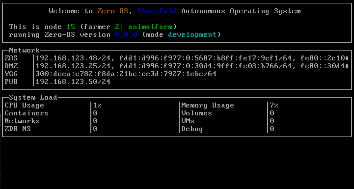

## Boot a node

To boot Zero OS on your node, plug in the USB stick and configure the BIOS to use it as the boot device. You can reference the documentation for your mainboard to learn how to do this. In case the node loses power or needs to restart for an update, this setting needs to be saved within the BIOS.

While you're in the BIOS, check that the "Network Stack" or "Network Boot" is also enabled to allow Zero OS to boot over the network. Some farmers have also found that "AHCI mode for SATA" is required to support SATA disks.

> __Note__
We strongly recommend to **always keep the USB stick plugged-in to your node**. Indeed, even if a minimum requirement is set at first boot, the USB stick is still needed for each reboot operation (in case of power outage for example). See [FAQ](https://library.threefold.me/info/manual/#/manual__faq?id=do-i-need-the-zero-os-bootstrap-image-drive-usb-or-cddvd-when-i-reboot-or-can-i-boot-zero-os-from-the-3node-main-hard-drive) for more technical details.

### Wiping disks

If the disks in your node have any data or partition tables on them, they will need to be wiped before Zero OS will utilize them. Nodes previously running on Grid 2 may not require this step.

See [these instructions](https://forum.threefold.io/t/how-to-clear-disks-for-diy-3nodes/987) for details on how to properly wipe disks.

### The node console screen

It may take a while for your node to boot up. Once that's complete, the screen should show something like you see above, with your own farm id and name listed.

Network setup will also look different. `PUB` will show `not configured` which is normal for a new node. If your node is assigned a public IP address and you'd like to register it for use on the Grid, see [public network config](public_config). This is not required to farm tokens or host workloads, so dont' worry about it if you're not sure.

### Checking the Explorer

You can use the Grid Explorer to check that your node is utilizing all of its disks and if it is online. Use the link for the network your node is on shown below. You can filter by your farm id to only show nodes attached to your farm.

!!!include:explorer_list

### Finished

That's it, you're now farming on ThreeFold Grid 3. Please considering sharing about your farm in [this thread](https://forum.threefold.io/t/lets-share-our-farming-setup/286) on our forum so other farmers can learn from your setup. You can also join our [farmers chat](https://t.me/threefoldfarmers) on Telegram for farming related discussion.

### Further Resources

For a very detailed explanation of the farm creation process, view [this forum post](https://forum.threefold.io/t/threefold-farming-guide-part-1/2989).
For a TL;DR, view [this forum post](https://forum.threefold.io/t/creating-a-farm-with-diy-nodes-tl-dr/3290)
