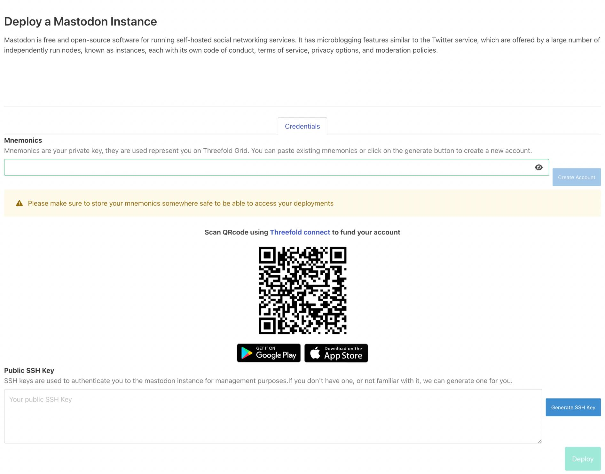
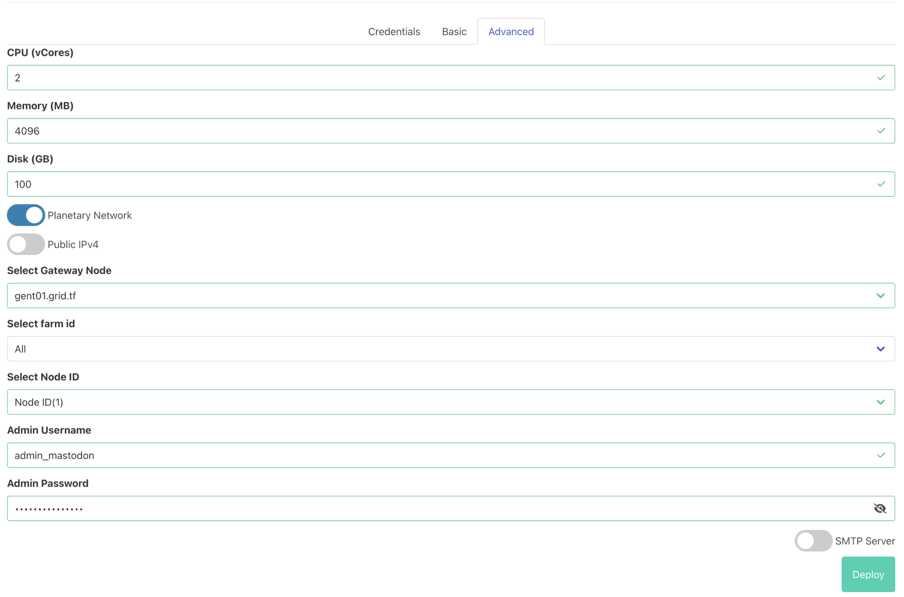
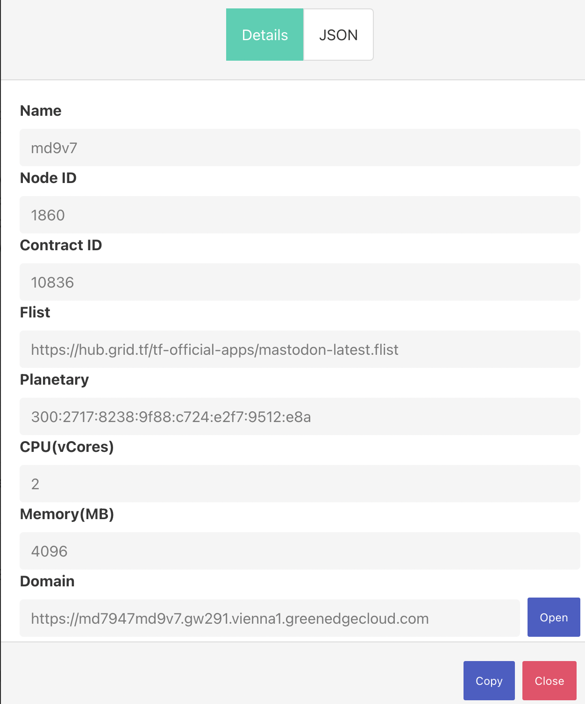
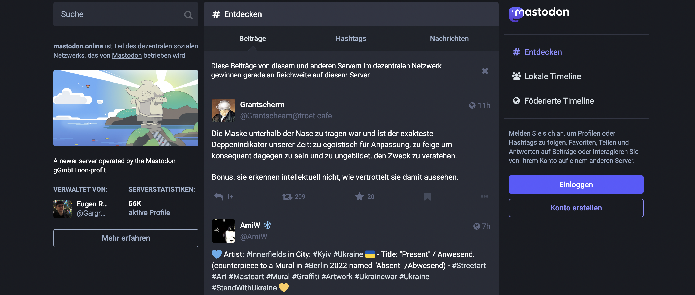
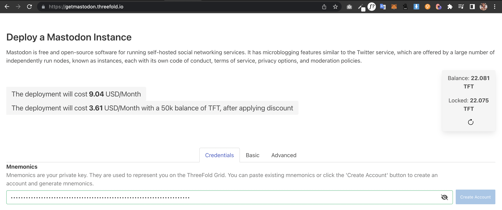

# Deploy a Mastodon Server 

On this tutorial you will learn on how to deploy a Mastodon Server using [www.getmastodon.threefold.io](www.getmastodon.threefold.io).
To deploy a Mastodon server as weblet, please see [Mastodon Weblet Tutorial](weblets_mastodon)

ThreeFold has made it possible for everyone to run their own Mastodon Instance, simply and effectively. Feel free to go to [www.mastodon.threefold.io](https://www.mastodon.threefold.io/) to read about ThreeFold's Mastodon Servers

## What is Mastodon

[Mastodon](https://joinmastodon.org/) is free and `open-source` software for running self-hosted social networking services. It has microblogging features similar to the Twitter service, which are offered by a large number of independently run nodes, known as `instances`, each with its own code of conduct, terms of service, privacy options, and moderation policies.

Each user is a member of a specific `Mastodon` instance `also called a server`, which can interoperate as a federated social network, allowing users on different instance to interact with each other. This is intended to give users the flexibility to select a node whose policies they prefer, but keep access to a larger social network. `Mastodon` is also part of the Fediverse ensemble of server platforms, which use shared protocols allowing users to also interact with users on other compatible platforms,[9] such as [PeerTube](./weblets_peertube.md).
`Mastodon` is crowdfunded and does not contain ads.

## Prerequisites

- TFT Wallet (TFTs are needed to fund the deployment), we recommend you to use **TF Connect App** [Android](https://play.google.com/store/apps/details?id=org.jimber.threebotlogin&hl=en&gl=US&pli=1) / [Apple](https://apps.apple.com/us/app/threefold-connect/id1459845885)

Please download TF Connect App before you proceed.

## Get Started

- Go to [www.getmastodon.threefold.io](www.getmastodon.threefold.io) to begin the deployment journey.

## Set Up New Account Credentials

At the deployment homepage, you will be presented on **'Credentials'** page

### Create an account by generating a Mnemonics
- **Mnemonics**: The login key to your Mastodon deployment (just like a password). 

If this is your first deployment, simply Click **'Create Account'** and the system will automatically generate random phrases that serve as your mnemonics.

**Please keep a copy of your mnemonics safe.** This would be the only way to recover your instance in the future. Failure to do so will result in a loss of account.

If you have created a deployment account via [www.getmastodon.threefold.io](www.getmastodon.threefold.io) before, simply copy and paste your existing mnemonics to deploy a new instance, and the system will automatically log you in, and displaying your existing deployment (if any).

### Top up Account Wallet

Now that you have successfully created your login key, you will need to top up the account by using a TFT Wallet. You need to first fund the account to continue to the next step because the blockchain would need some TFT to fund an account creation.

Simply scan the QR Code shown to transfer TFT from your TFT wallet to your deployment account. We recommend you to transfer min. 20 TFT to begin with. You can recharge your account anytime.

It may takes a few minutes until the transfer is successful. We would recommend that you keep your windows open, otherwise you would need to re-login again by using your mnemonic keys. If you accidentally closed your window, you will not have to worry as the transfer will still proceed and you can simply re-login again.

### Generate your SSH Keys

After you have successfully transfered some TFT, you will be asked to generate SSH Keys (for new accounts only) by clicking **‘Generate’** button on the right side. This key is used to authenticate and establish an encrypted communication channel to your Mastodon.

If you have previously generated SSH keys on existing profile, you may skip this step.
Once you have done all the steps above, we can move on to setup your first Mastodon server by clicking either the 'Basic' or 'Advance' setup options.

## Setting up Your Mastodon Server

- **Basic** Setup: Mastodon Server deployment setting with pre-configured deployment setup (capacity and network configurations)
- **Advance** Setup: Mastodon Server deployment setting for users who prefer to choose their own deployment configuration (capacity and network configurations). For this you still need to configure some variables like admin email and deployment name before configuring the advance setup.

## Basic Setup

Basic Mastodon Server Setup consists of:
- Mastodon instance name: This will be used to identify your deployment, as well as your Mastodon Server subdomain. Please add a name to your new server.
- Admin Email: Please add an email used as the server's administrator's email.
- Region: Please choose the preferred region for new Mastodon server.
- Enable TF Connect: You can choose of whether you'd like an extra step for your server users to login using TFConnect App or not.
- Certified: You can choose of whether you'd like to deploy your server using Threefold certified 3Node or DIY node farms. Certified nodes are nodes that farmers bought from ThreeFold Certified Nodes partners. 

If you choose to only do basic setup, you don't need to configure the advance setup. Once you have filled the forms above, simply click **'Deploy'** and you will be notified when your deployment is successful!

Please keep in mind that **you need to have sufficient amount of TFTs** in your deployment wallet in order your deployment to be successful.
To top up your wallet, simply go back to **'Credentials'** and transfer TFTs to your account.

## Advance Setup

Before configuring the advance setup please keep in mind that you would need to configure the  too.

Advance Mastodon Server Setup consists of:
- CPU: Choose the total number of CPU resource for your Mastodon Server
- Disk (Gb): Choose the total size of Disk (Storage) resource for your Mastodon Server
- IP (Internet Protocol): Choose the Internet Protocol Mode for your Mastodon Server. You can either choose to deploy your server on ThreeFold's Planetary Network, a IPv4 or IPv6. Learn about the differences [here](https://www.geeksforgeeks.org/differences-between-ipv4-and-ipv6/).
- Web Gateway: You can choose a specific node farm for your Mastodon Server
- Node Farm: Select a specific node farm for your Mastodon Server
- Node ID: Deploy your Mastodon Instance using a specific Node
- Admin Username: Create a username for you Mastodon Server
- Password: Create password for you Mastodon Server

Once you have filled the forms above, simply click **'Deploy'** and you will be notified when your deployment is successful!

Please keep in mind that **you need to have sufficient amount of TFTs** in your deployment wallet in order your deployment to be successful.
To top up your wallet, simply go back to **'Credentials'** tab and transfer TFTs to your account.

## Manage Your Deployment Account and Server(s)

### Managing Servers

After you successfully deployed a mastodon server, you can simply manage your deployment on the **'Deployment List (Mastodon)'** section at the bottom of the page inside your account. This page shows all the servers you have deployed via [www.getmastodon.threefold.io
](www.getmastodon.threefold.io) including the billing rate and all the deployment details.

- Show Details: You can see the details of your deployment, such as admin username, password, email, and all the complete list of the server configuration.

- Open: is a link to your Mastodon Server.
- Delete: delete your Mastodon Server.

### Accessing your Mastodon Server

Simply click 'Open' on one of your server in the list to go to your Mastodon Server.

## Accessing (Re-login) to Your (existing) Account

Once you have successfully created an account and deployed your Mastodon server, to regain access to your deployment account manage your active Mastodon Servers or to create a new one, simply go to [wwww.getmastodon.threefold.io](wwww.getmastodon.threefold.io)
and **copy paste your existing Account Mnemonics**. You will be automatically logged into your account once you have done so.

Once you're logged in, you will also be shown how much TFT Balance left you have in your account, as well as the list of Mastodon Servers you currently have.

## Conclusion

Deploying [Mastodon](https://www.mastodon.threefold.io/) have never been easier. ThreeFold has made it possible for everyone to deploy and run their own Mastodon Server, simply and effectively. Let’s get started and happy experimenting!

> Read the FAQ on Mastodon Servers Powered by ThreeFold [here](threefold_mastodon_faq).

