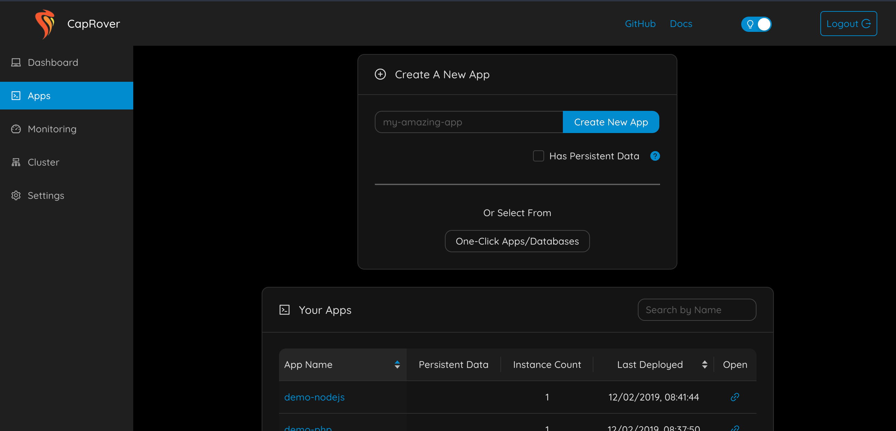
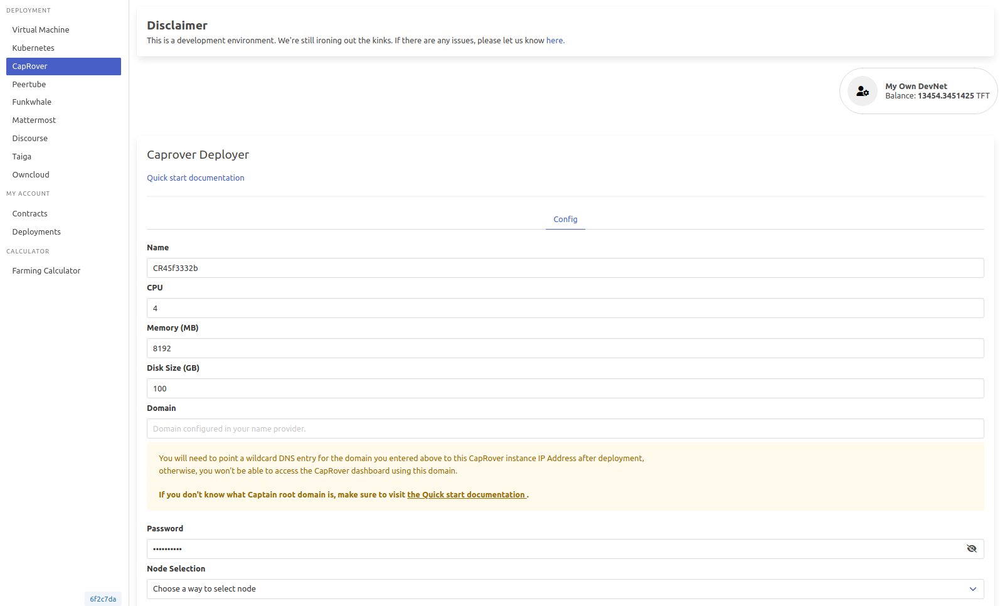
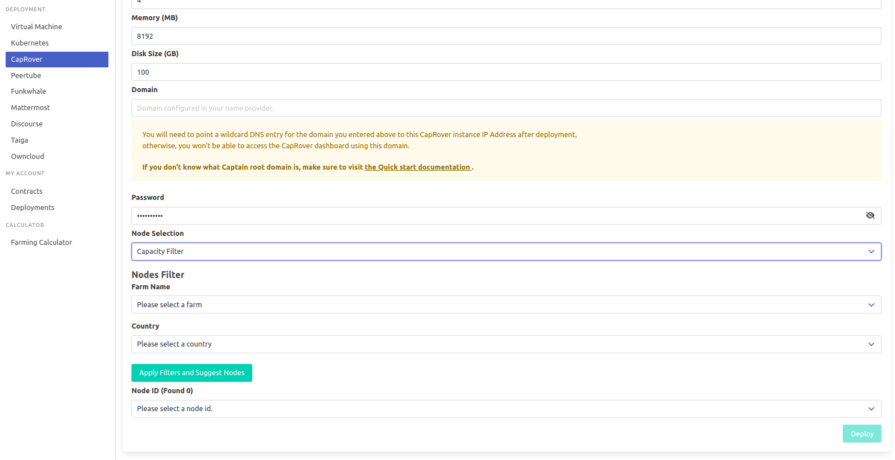
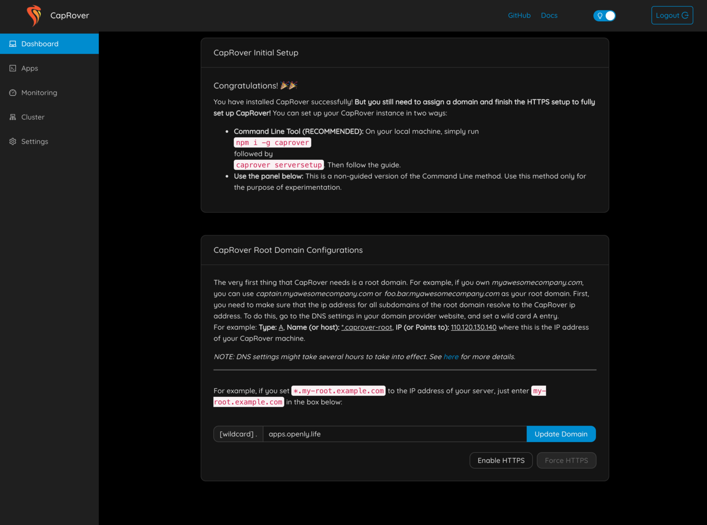

# Caprover



About caprover

CapRover is an extremely easy to use app/database deployment & web server manager for your NodeJS, Python, PHP, ASP.NET, Ruby, MySQL, MongoDB, Postgres, WordPress (and etc...) applications!

It's blazingly fast and very robust as it uses Docker, nginx, LetsEncrypt and NetData under the hood behind its simple-to-use interface.

- CLI for automation and scripting
- Web GUI for ease of access and convenience
- No lock-in! Remove CapRover and your apps keep working!
- Docker Swarm under the hood for containerization and clustering
- Nginx (fully customizable template) under the hood for load-balancing
- Let's Encrypt under the hood for free SSL (HTTPS)


Caprover is a very cool management app for containers based on Docker Swarm.

It has following benefits : 

- easy to deploy apps (in seconds)
- easy to create new apps
- super good monitoring
- can be extended over the TFGrid

### Requirements

- you need an account on TF-Chain, and there needs to be TFT on the account (see getting started)
- [Make sure your profile is activated](weblets_profile_manager)
- [Unlock your profile on profile manager, if already filled in before](profile_manager_unlock)

### Usage

!!!include:weblets_play_go



- Choose a node to deploy Caprover on.
- Either use the **Capacity Filter**. Which simply lets you pick a *Farm* and *Country*, after clicking on *Apply filters and suggest nodes* then it lists available nodes with these preferences and you pick. 

   
    
- Or use **Manual** and type a specific node number to deploy on.

  

- Be very careful about the domain name: it needs to be a wildcard domain name you can configure in your chosen domain name system.


Deployment will take couple of minutes.

### The Domain Name

- e.g. I choose ```apps.openly.life``` which is a domain name who will point to the ip address of the CapRover (which we only know after install).


> Note how the *.apps.openly.life points to the public IPv4 address as has been returned from the deployment.

### How to know what the IP address is?

Go back to your CapRover weblet and go to the deployment list. Click on `Show Details`.


- The public IPv4 address is visible in here
- Now you can configure the domain name (see above, don't forget to point the wildcard domain to the public IP address)

Click on details if you want to see more details

```json

{
    "version": 0,
    "name": "caprover_leader_cr_156e44f0",
    "created": 1637843368,
    "status": "ok",
    "message": "",
    "flist": "https://hub.grid.tf/samehabouelsaad.3bot/tf-caprover-main-a4f186da8d.flist",
    "publicIP": {
        "ip": "185.206.122.136/24",
        "gateway": "185.206.122.1"
    },
    "planetary": false,
    "yggIP": "",
    "interfaces": [
        {
            "network": "caprover_network_cr_156e44f0",
            "ip": "10.200.4.2"
        }
    ],
    "capacity": {
        "cpu": 4,
        "memory": 8192
    },
    "mounts": [
        {
            "name": "data0",
            "mountPoint": "/var/lib/docker",
            "size": 107374182400,
            "state": "ok",
            "message": ""
        }
    ],
    "env": {
        "SWM_NODE_MODE": "leader",
        "CAPROVER_ROOT_DOMAIN": "apps.openly.life",
        "PUBLIC_KEY": "ssh-rsa AAAAB3NzaC1yc2EAAAADAQABAAABAQC/9RNGKRjHvViunSOXhBF7EumrWvmqAAVJSrfGdLaVasgaYK6tkTRDzpZNplh3Tk1aowneXnZffygzIIZ82FWQYBo04IBWwFDOsCawjVbuAfcd9ZslYEYB3QnxV6ogQ4rvXnJ7IHgm3E3SZvt2l45WIyFn6ZKuFifK1aXhZkxHIPf31q68R2idJ764EsfqXfaf3q8H3u4G0NjfWmdPm9nwf/RJDZO+KYFLQ9wXeqRn6u/mRx+u7UD+Uo0xgjRQk1m8V+KuLAmqAosFdlAq0pBO8lEBpSebYdvRWxpM0QSdNrYQcMLVRX7IehizyTt+5sYYbp6f11WWcxLx0QDsUZ/J"
    },
    "entrypoint": "/sbin/zinit init",
    "metadata": "",
    "description": "caprover leader machine/node"
}
```

### How to access the admin interface ?

- make sure your public IP address (in my case ```185.206.122.136```) is filled in in the domain name record.

> admin url: https://captain.apps.openly.life/   (note prefix captain, and the usage of our wildcard domain).
<br> 
> The password is generated and visible behind the `Show Details` button of your CapRover deployment. 


You should now see



### How to work with CapRover

> [see our caprover admin small tutorial](weblets_caprover_admin)