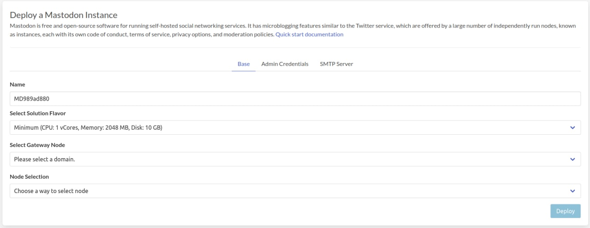
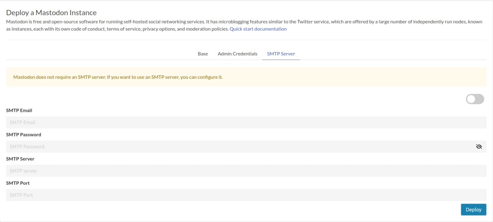
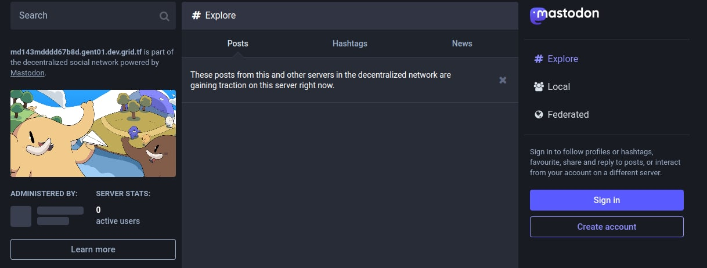

# Mastodon

[Mastodon](https://joinmastodon.org/) is free and `open-source` software for running self-hosted social networking services. It has microblogging features similar to the Twitter service, which are offered by a large number of independently run nodes, known as `instances`, each with its own code of conduct, terms of service, privacy options, and moderation policies.

Each user is a member of a specific `Mastodon` instance `also called a server`, which can interoperate as a federated social network, allowing users on different instance to interact with each other. This is intended to give users the flexibility to select a node whose policies they prefer, but keep access to a larger social network. `Mastodon` is also part of the Fediverse ensemble of server platforms, which use shared protocols allowing users to also interact with users on other compatible platforms,[9] such as [PeerTube](./weblets_peertube.md).
`Mastodon` is crowdfunded and does not contain ads.

!!!include:weblets_play_go
- Make sure you have an activated [profile](weblets_profile_manager)
- Click on the **Mastodon** tab

__Process__ :

- Enter an Application Name. It's used in generating a unique subdomain on one of the gateways on the network alongside your twin ID. Ex. ***imastodon*.gent02.dev.grid.tf**

- Select a capacity package:
    - **Minimum**: {cpu: 1, memory: 1024 * 2, diskSize: 10 }
    - **Standard**: {cpu: 2, memory: 1024 * 4, diskSize: 50 }
    - **Recommended**: {cpu: 4, memory: 1024 * 4, diskSize: 100 }
    - Or choose a **Custom** plan
- Choose a gateway node to deploy your Mastodon instance on.

- Select a node to deploy your Mastodon instance on.

    - Either use the **Capacity Filter**. Which simply lets you pick a *Farm* and *Country*, after clicking on *Apply filters and suggest nodes* then it lists available nodes with these preferences and you pick.

    - Or use **Manual** and type a specific node number to deploy on.

- Then you have to configure your admin email in **Admin Credentials** to your instance server won't run without it.

   

- There's also an optional **Mail Server** tab if you'd like to have your Mastodon instance configured with an SMTP server.

   

After that is done you can see a list of all of your deployed instances

Click on ***Visit*** to go to the homepage of your Mastodon instance! You have to login to take full access.

